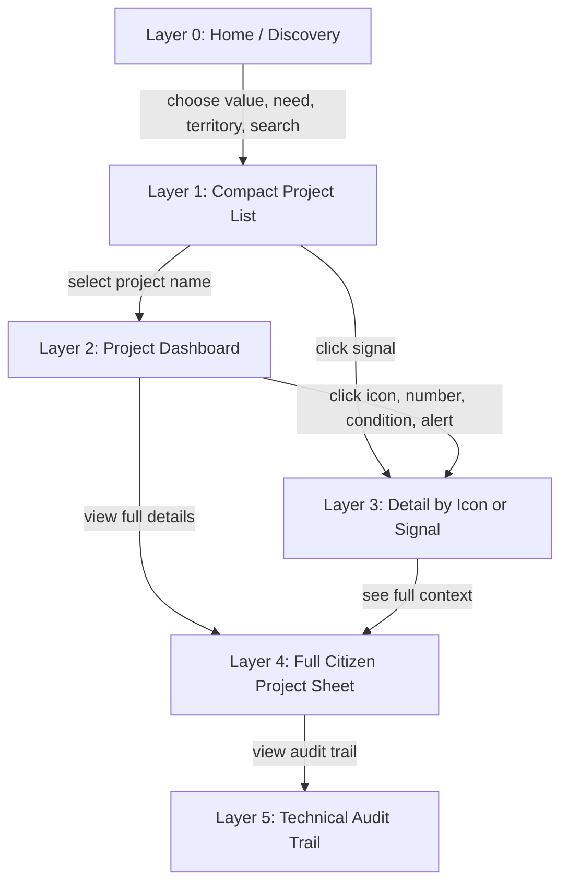
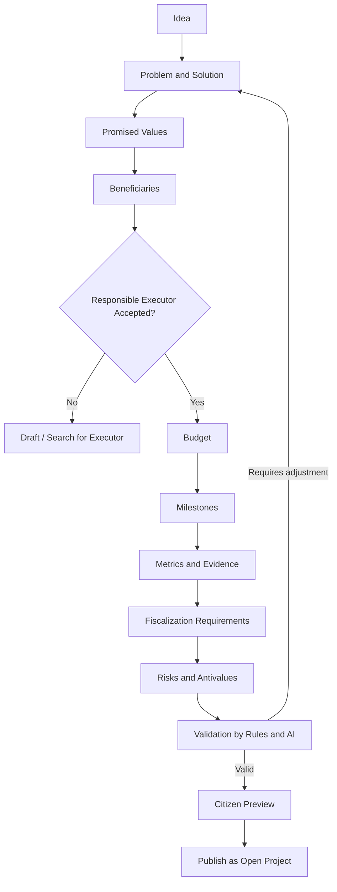
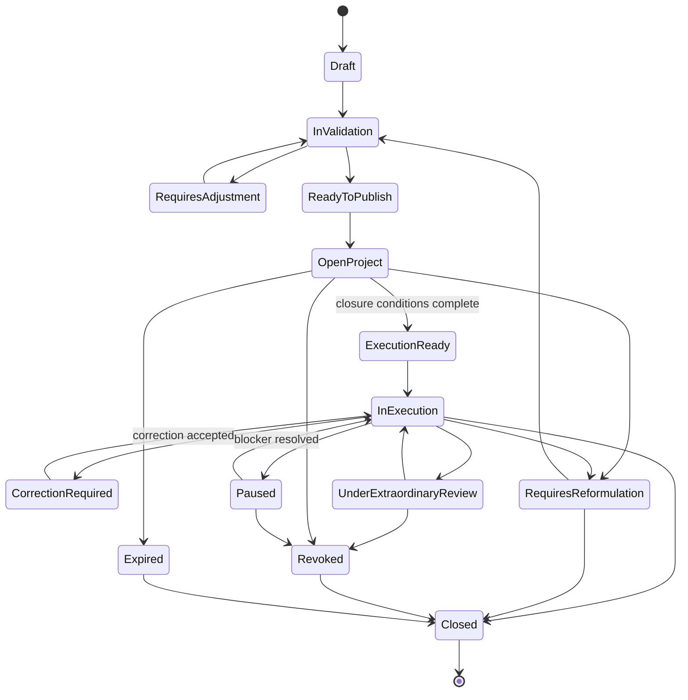
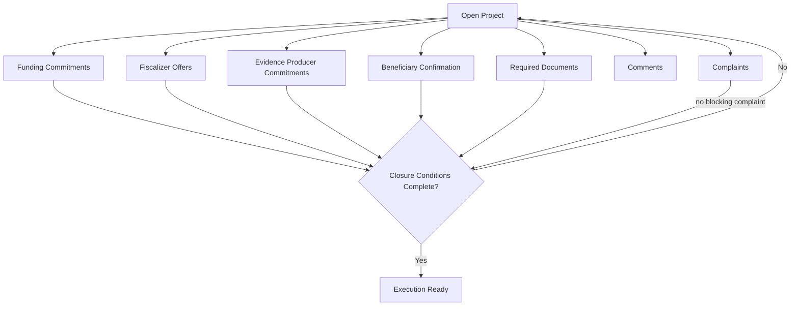
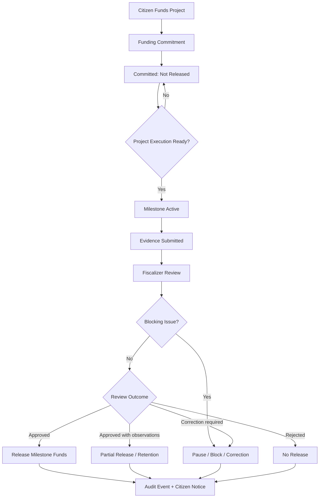
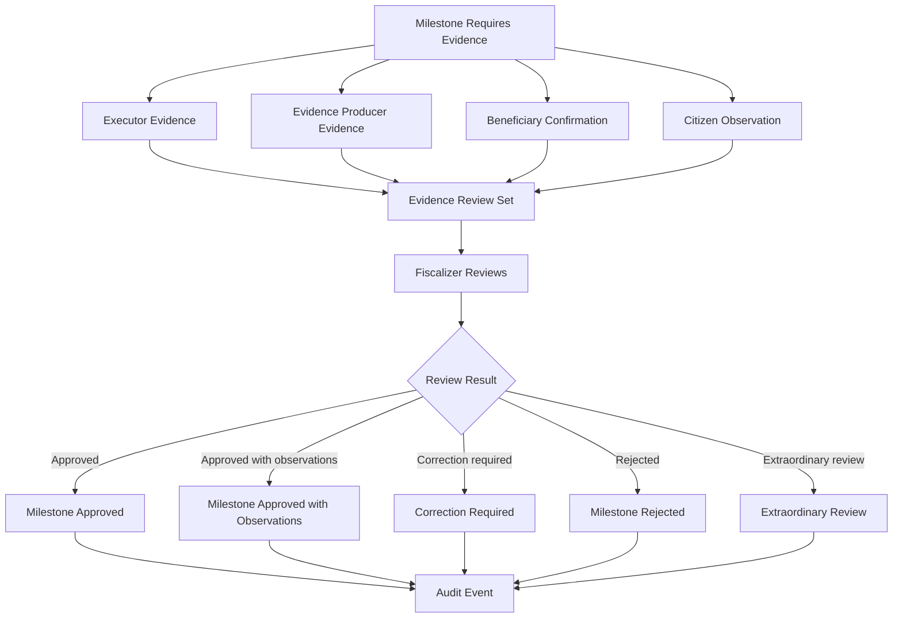
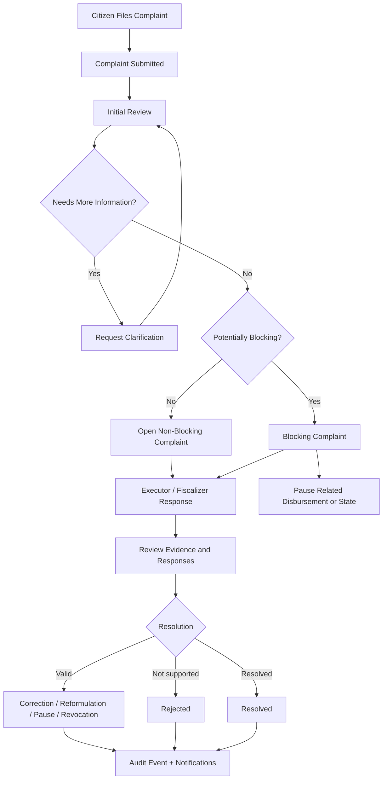
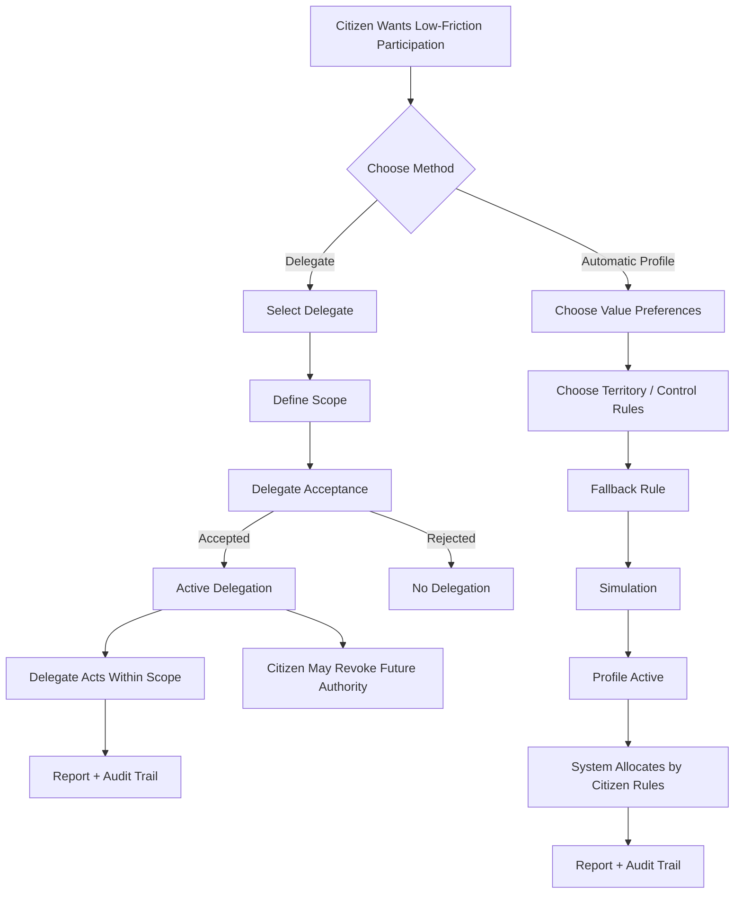
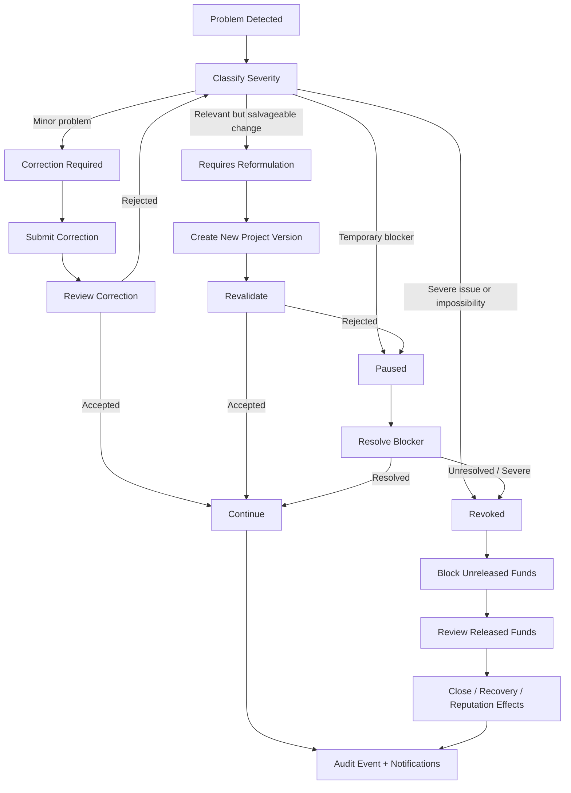
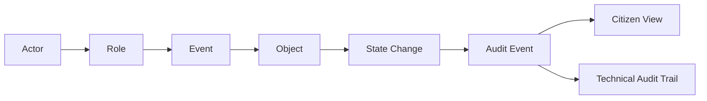

# Diagram Index and Flow Diagrams v0

## Purpose

This document freezes the first diagram set for the Distributed Governance System v0.

The goal is not to create final visual design artifacts. The goal is to make the system legible as flows, states, and transitions before moving into stress testing, scope classification, and paper architecture.

## Status

Accepted as Diagram Index and Flow Diagrams v0.

## Diagram principle

> Every diagram should show which object changes state, which actor or rule triggers the change, and where auditability is preserved.

The diagrams should remain simple enough to reason about but precise enough to expose missing states, weak transitions, and responsibility gaps.

## Diagram set v0

This first set includes:

1. Citizen navigation layers;
2. Project creation and publication;
3. Project lifecycle after publication;
4. Funding and disbursement;
5. Evidence and fiscalization;
6. Complaint and review;
7. Delegation and automatic allocation;
8. Reformulation, pause, and revocation;
9. Audit trail pattern.

## 1. Citizen navigation layers



### Rule

> The citizen starts with simple discovery and can progressively reach full auditability by choice.

## 2. Project creation and publication flow



### Rule

> Creating a project means converting an idea into a public promise that is verifiable, financeable, fiscalizable, and traceable.

## 3. Project lifecycle after publication



### Rule

> A project advances by completing conditions and passing review, not by self-declared progress.

## 4. Open project parallel closure



### Rule

> Open projects gather multiple conditions in parallel before becoming execution-ready.

## 5. Funding and disbursement flow



### Rule

> Funding is commitment. Disbursement is conditional release after milestone, evidence, review, rule, and traceability.

## 6. Evidence and fiscalization flow



### Rule

> Evidence producers create verifiable material. Fiscalizers evaluate compliance.

## 7. Complaint and review flow



### Rule

> Complaints must be easy to file, hard to ignore, and structured enough to review fairly.

## 8. Delegation and automatic allocation



### Rule

> Delegation authorizes another actor. Automatic allocation applies citizen-defined rules. They are not the same mechanism.

## 9. Reformulation, pause, and revocation flow



### Rule

> Project failure handling must be proportional, visible, reversible where possible, final where necessary, and always auditable.

## 10. Audit trail pattern



### Rule

> Every important system decision should be expressible as: actor in role performs event on object, causing a state change recorded as audit event.

## Diagram index for next refinements

The next diagram refinements should be created as separate files or subsections:

```text
Project lifecycle state diagram
Funding and disbursement state diagram
Evidence and fiscalization sequence diagram
Complaint resolution sequence diagram
Delegation state diagram
Project creation sequence diagram
Operating mode transition diagram
Audit event schema diagram
```

## Design rule

> Diagrams are not decorative. They are tools for detecting missing states, hidden authority, uncontrolled money movement, and weak accountability.
