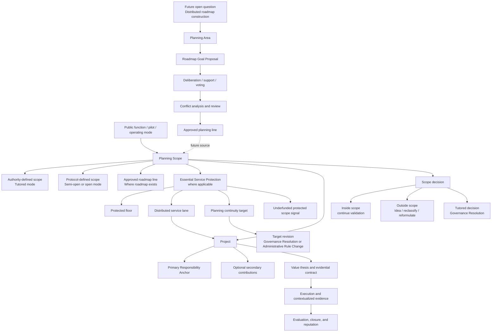

# Diagram - Planning Scope Alignment and Future Roadmap Construction

This diagram captures the current H009 and A005 alignment: Core v0 requires planning-scope alignment for financeable projects, while full distributed roadmap construction remains an open question. Where a scope affects essential guarantees or continuity, Core v0 also requires an Essential Service Protection floor-and-lane check.

## Key rules represented

1. Core v0 requires active Planning Scope alignment before execution financing.
2. A Planning Scope may be authority-defined in tutored mode, protocol-defined in open or semi-open mode, or linked to an approved roadmap where one exists.
3. A project must declare exactly one Primary Responsibility Anchor inside the active scope.
4. A project may declare secondary contributions, but accountability remains tied to the anchor unless a contribution is also defined as a formal measured commitment.
5. Outside-scope ideas should not disappear; they may remain Ideas, be reclassified, be reformulated, or inform future scope proposals.
6. Material tutored scope decisions should create Governance Resolutions under C020.
7. Essential or continuity-sensitive scopes should show protected floor, distributed service lane, planning-continuity target, funding-lane treatment, and underfunded protected-scope signal where applicable.
8. Changing an essential planning target requires a public, versioned, auditable Governance Resolution, Administrative Rule Change, or equivalent trace.
9. Distributed roadmap construction through votable planning areas is preserved as a future open question, not Core v0.

## Current status

This is a conceptual diagram. Core v0 covers Planning Scope Alignment. Full roadmap-construction governance remains unresolved.
