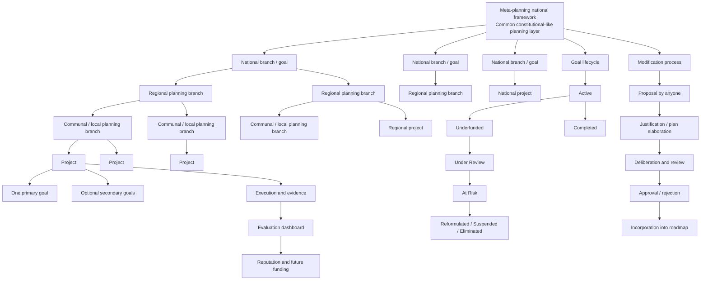

# Diagram - Distributed Planning Architecture v1

This diagram captures the current conceptual model of binding and evolutionary distributed planning.

## Key rules represented

1. There is a single national meta-planning framework for coherence.
2. National, regional, communal, and local branches can coexist.
3. A project must attach to the level that corresponds to its scope.
4. A project must declare exactly one primary goal.
5. A project may declare secondary goals, but accountability is tied to the primary goal.
6. Goals are binding but not irreversible.
7. Goals can be added, modified, reformulated, suspended, or eliminated.
8. Planning conflicts should be visible rather than hidden.
9. Evaluation and future funding depend on evidence and performance.

## Current status

This is a conceptual diagram, not an implementation design.
