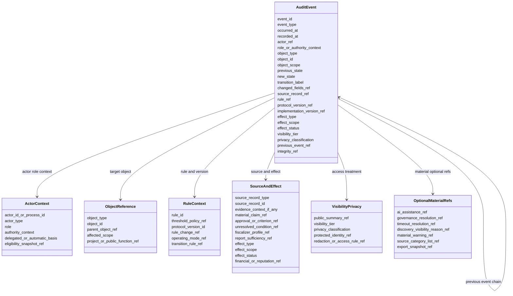
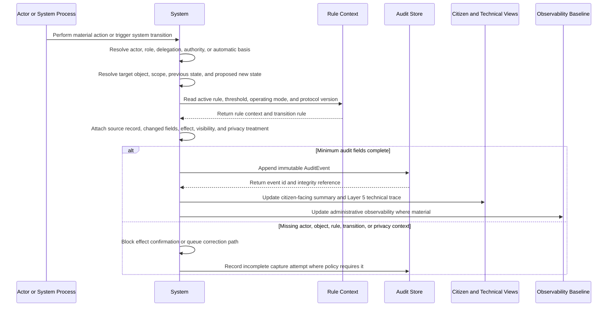

# Diagram - Audit Event Schema v0

## Purpose

Define the minimum `AuditEvent` schema needed to reconstruct material system activity without turning ordinary citizen views into technical logs.

`AuditEvent` is not a decision, evidence item, complaint, evaluation, governance resolution, reputation input, or financial order. It is the immutable trace record that shows how those objects changed, which actor or process caused the change, which rule/version applied, what effect resulted, and which visibility or privacy treatment governs the record.

Source baseline:

- `docs/20_PROJECT_TECHNICAL_AUDIT_TRAIL_LAYER.md`
- `docs/35_CONSOLIDATED_ENTITY_OBJECT_STATE_MAP.md`
- `docs/64_FORMAL_ENTITY_INVENTORY_V0.md`
- `docs/diagrams/v0-audit-trail-pattern.md`
- `docs/57_PROTOCOL_CHANGE_AND_C019_RESOLUTION.md`
- `docs/58_TUTORED_MODE_GOVERNANCE_RESOLUTIONS_AND_C020_RESOLUTION.md`
- `docs/59_CORE_ADMINISTRATIVE_OBSERVABILITY_BASELINE_AND_C021_RESOLUTION.md`

Related sources: C008, C019, C020, C021, C024, C025, H003, H008, H015, H017, A002, A003.

## Audit Event Schema



## Capture Sequence



## Append-Only Lifecycle and Correction Pattern

```mermaid
stateDiagram-v2
    [*] --> CaptureRequested

    CaptureRequested --> ContextResolved: actor, role, object, scope resolved
    ContextResolved --> RuleAttached: rule and protocol version attached
    RuleAttached --> SourceEffectAttached: source record and effect classified
    SourceEffectAttached --> VisibilityPrivacyAssigned: access and privacy treatment assigned
    VisibilityPrivacyAssigned --> CompletenessCheck: minimum schema checked

    CompletenessCheck --> AppendReady: required fields present
    CompletenessCheck --> CaptureIncomplete: missing required context
    CaptureIncomplete --> ContextResolved: corrected before effect confirmation
    CaptureIncomplete --> CaptureAbandoned: no valid effect recorded

    AppendReady --> AppendedImmutable: audit event written
    AppendedImmutable --> CitizenProjectionGenerated: simple public signal updated
    AppendedImmutable --> Layer5Available: full trace available under access rules
    AppendedImmutable --> ObservabilityUpdated: aggregate metrics updated where material
    AppendedImmutable --> ExportSnapshotLinked: export or permanent snapshot created where needed

    AppendedImmutable --> CorrectiveEventLinked: later correction, reversal, or supersession occurs
    CorrectiveEventLinked --> AppendedImmutable: original remains immutable; new event explains change

    CitizenProjectionGenerated --> [*]
    Layer5Available --> [*]
    ObservabilityUpdated --> [*]
    ExportSnapshotLinked --> [*]
    CaptureAbandoned --> [*]
```



## Minimal Required Fields

Every material `AuditEvent` should identify:

```text
event id
event type
occurred timestamp
recorded timestamp
actor or system process
role, delegation basis, authority context, or automatic-process basis
target object type
target object id
affected scope
previous state or previous material value, where applicable
new state or new material value, where applicable
transition label
source record reference
rule, threshold policy, operating mode, or protocol version applied
effect type
effect scope
effect status
visibility tier
privacy classification
previous event reference or integrity reference where applicable
```

Conditional fields should be included when material:

```text
changed fields reference
rule-change object reference
implementation version
material AI assistance reference
contextualized evidence item reference
evidence context
material information claim reference
approval source, criterion source, scope, condition, or limitation reference
fiscalizer eligibility and reputation profile reference
fiscalization report sufficiency reference
governance resolution reference
review timeout resolution reference
financial order, disbursement, or guarantee reference
responsibility, reputation input, or reputation update reference
protected identity request reference
discovery visibility reason reference
material warning visibility state
AI-generated summary source categories and limitations
export snapshot reference
```

## Rules

- Material system transitions should not be considered fully confirmed unless the audit event can identify actor or process, object, scope, state/value transition, rule/version, source, effect, visibility, and privacy treatment.
- `AuditEvent` is append-only. If a recorded event is later corrected, reversed, narrowed, or superseded, the correction is another linked event; the original event is not silently edited away.
- Citizen-facing layers may show simple labels, summaries, and links. Layer 5 preserves the full technical event record.
- Privacy classification and protected identity references preserve auditability without exposing protected personal data to unauthorized viewers.
- AI assistance may be referenced as a material assistance trace, but it is not treated as actor, authority, evaluator, fiscalizer, or truth-decider by default.
- Discovery visibility reasons are recorded only when visibility materially affects attention, funding, legitimacy, or auditability.
- Approval, almost-funded, execution-ready, recommended, urgent, or AI-summary labels should be reconstructable to source records and unresolved material-warning state when material.
- Responsible fiscalizer assignment and report effects should be reconstructable to eligibility criteria, contextual profile, relationship/capture warnings, report sufficiency, and safeguards where material.
- Observability metrics are derived from audit events and source objects. They should not become hidden decision scores.

## Macul Sports Example Trace

```text
Action:
Authority rejects "Design and Construction of Multi-Courts in Macul" as duplicate.

AuditEvent:
actor/process = external sports authority or authorized review process
role/context = tutored-scope reviewer
object = Governance Resolution for the project submission
previous state = review window open
new state = governance resolution issued / rejected
rule = active Planning Scope duplication rule and operating-mode review policy
source = authority decision package
effect = project not opened for publication under that scope
visibility = public summary plus Layer 5 trace
privacy = ordinary public authority record, with official detail limited where law requires

Later correction:
If the authority corrects the decision after clarification, the correction is a new linked AuditEvent. The original rejection remains visible as historical trace.
```

## Boundary With Other Diagrams

This diagram does not define each domain object's lifecycle. It defines the common trace schema used by project, evidence, complaint, funding, disbursement, fiscalization, delegation, operating-mode, governance-resolution, rule-change, discovery, and reputation diagrams.

## Rule

> Every material system effect should be reconstructable as: actor or process, acting in a role or authority context, changes an object under a rule/version, with a source, effect, visibility/privacy treatment, and immutable audit reference.
