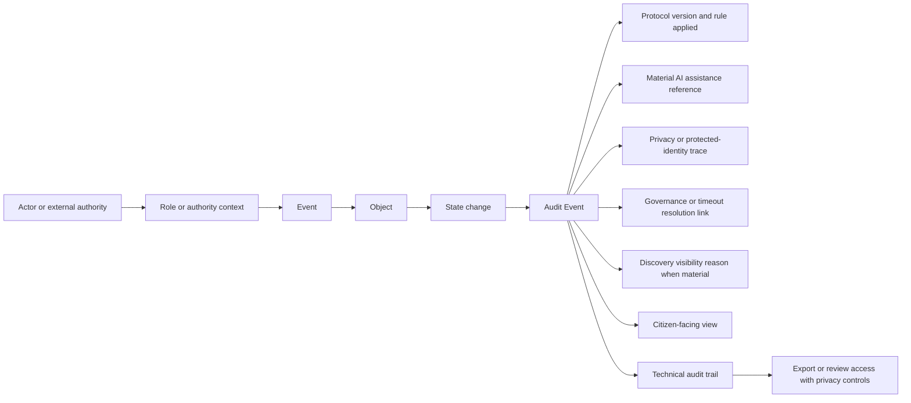

# Diagram - Audit Trail Pattern v0

## Purpose

Show the common audit structure for material decisions, state changes, AI assistance, privacy actions, governance resolutions, and discovery visibility effects.

Related resolutions: C008, C019, C020, C024, C025.

## Rule

> Every important system decision should be expressible as: actor in role performs event on object, causing a state change recorded as an audit event with protocol, privacy, AI, governance, and discovery context where material.
