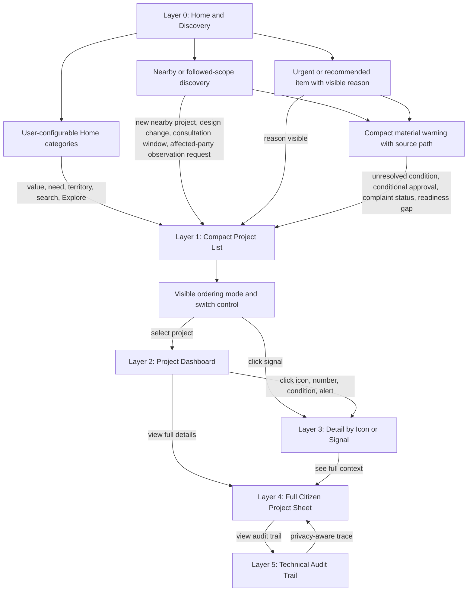

# Diagram - Citizen Navigation Layers v0

## Purpose

Show how citizens move from simple discovery to deeper auditability without making the first screen administratively heavy.

Related resolutions: C009, C021, C024, C025, A001, A002.

## Rule

> The citizen starts with simple navigation, can customize the Home surface, follow nearby or thematic scopes, see why projects are highlighted or ordered, see compact material warnings when favorable labels have unresolved conditions, participate asynchronously in affected-party windows, and progressively reach full auditability by choice.
