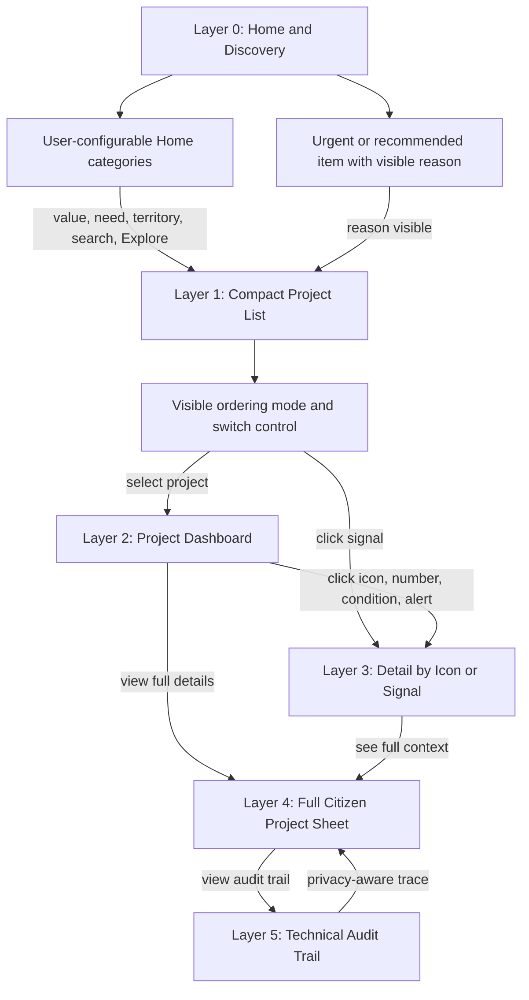

# Diagram - Citizen Navigation Layers v0

## Purpose

Show how citizens move from simple discovery to deeper auditability without making the first screen administratively heavy.

Related resolutions: C009, C021, C024, C025.

## Rule

> The citizen starts with simple navigation, can customize the Home surface, sees why projects are highlighted or ordered, and can progressively reach full auditability by choice.
