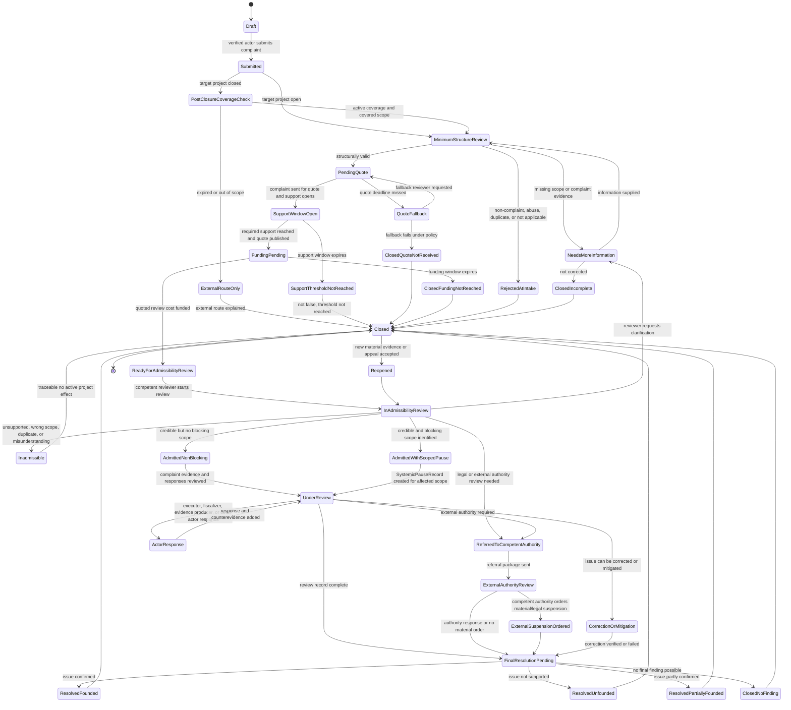
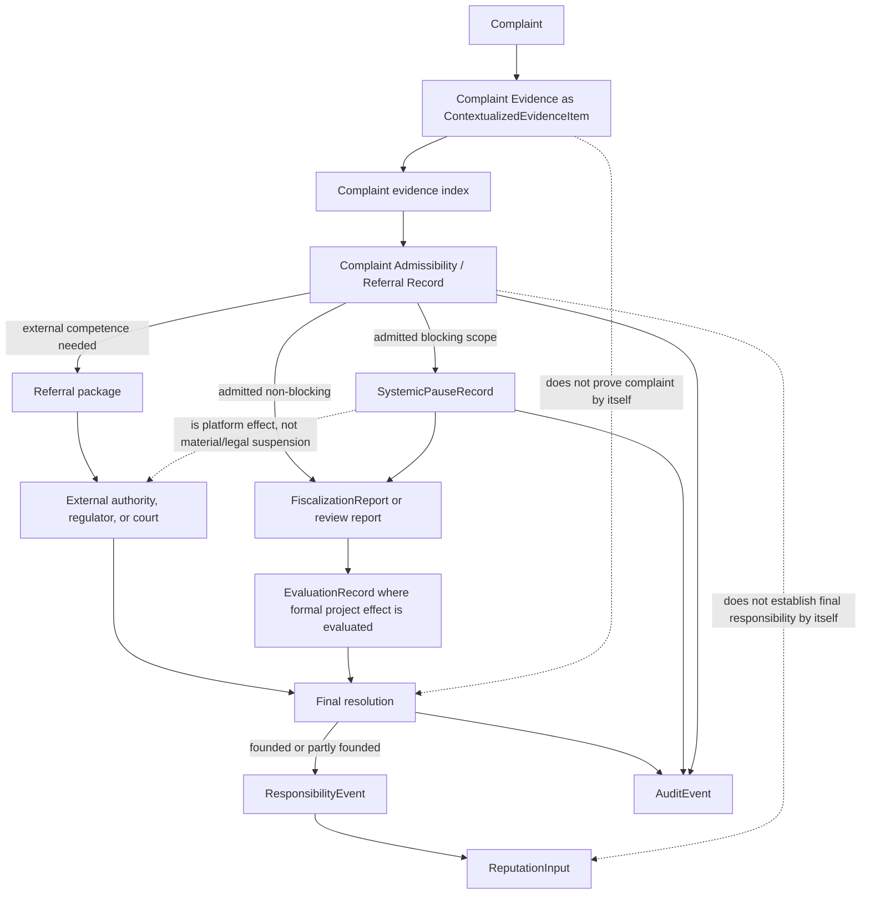

# Diagram - Complaint Evidence and Review State v0

## Purpose

Show the formal lifecycle of a `Complaint` and how `Complaint Evidence` enters review without becoming proof, blocker, responsibility, reputation, or legal effect by itself.

This diagram refines the older complaint-review flow. It uses `ContextualizedEvidenceItem` as the evidence substrate and separates complaint filing, support, quote, review funding, admissibility, scoped systemic pause, competent-authority referral, final resolution, and role-specific consequences.

Source baseline:

- `docs/41_COMPLAINT_ENTITY_AND_C004_RESOLUTION.md`
- `knowledge/hypotheses/H024-complaint-as-fiscalization-trigger.md`
- `knowledge/hypotheses/H013-pause-mitigation-revocation-governance.md`
- `knowledge/concepts/systemic-pause-material-suspension-v0.md`
- `docs/26_CITIZEN_COMPLAINT_FLOW.md`
- `docs/diagrams/v0-contextualized-evidence-item-state.md`

Related sources: H013, H014, H015, H016, H024, C004, C005, C014, C024, A007.

## Complaint State Machine



## Complaint Evidence and Effect Routing



## State Rules

- `Submitted` means a verified actor filed a complaint. It does not mean the allegation is true.
- `PostClosureCoverageCheck` applies only when the target project is already closed. Platform review continues only if the active Post-Closure Coverage Profile is open and covers the issue.
- `ExternalRouteOnly` means ordinary platform review is not available because the post-closure window expired or the issue is outside covered scope. The citizen is routed to court, regulator, comptroller, contract, competent authority, or country-specific channels, and a later final external decision may be recorded where allowed.
- `SupportWindowOpen` means citizens may support, object, contribute complaint evidence, and reserve conditional review funding. Support is attention for review, not proof.
- `PendingQuote` and `FundingPending` are procedural funding states. They do not block project execution or disbursement by themselves.
- `ReadyForAdmissibilityReview` requires configured support, quote, review funding, and minimum complaint evidence or initial supporting material.
- `AdmittedNonBlocking` means the complaint proceeds without a blocking system effect.
- `AdmittedWithScopedPause` requires an affected scope and creates a `SystemicPauseRecord` only for that scope.
- `ReferredToCompetentAuthority` means the platform can prepare and fund review/referral, but legal or material suspension remains external unless law or enforceable obligation grants that effect.
- `ResolvedFounded`, `ResolvedPartiallyFounded`, or an external decision may create `ResponsibilityEvent`, `ReputationInput`, recovery, correction, mitigation, closure, or revocation effects where the relevant rule allows it.
- Rejected, inadmissible, unfounded, unsupported, or threshold-not-reached complaints remain traceable history, but they are not active proof of project failure.

## Complaint Evidence Rules

- Complaint evidence is a `ContextualizedEvidenceItem` with `evidence_context = complaint`.
- Complaint evidence may support, refute, or contextualize an allegation, but does not prove the complaint by itself.
- Complaint evidence may later also become fulfillment/control evidence only if a reviewer, fiscalizer, competent authority, or protocol rule accepts a separate context for that formal use.
- Complaint objections are counter-signals and may include counterevidence, but they do not numerically veto the support threshold.
- Complaints against the fiscalizer, complaint reviewer, or a conflicted control actor require an independent reviewer path.
- Protected identity may restrict public display of a verified complainant, but it does not create anonymous formal power.

## Macul Example Trace

```text
Complaint:
Citizens allege that the Macul multi-court design omits required bathrooms or has wrong court dimensions.

Complaint evidence:
photos, design screenshots, public-access commitments, dimension comparisons, or affected-party observations.

Procedural path:
Submitted -> PendingQuote -> SupportWindowOpen -> FundingPending -> ReadyForAdmissibilityReview

If admissible:
AdmittedWithScopedPause
SystemicPauseRecord affects construction phase, construction disbursement, or disputed design evidence use.

Not automatic:
No final negative reputation update.
No physical construction halt unless a competent authority, court, regulator, legal rule, or enforceable obligation creates that material/legal effect.

Final effect:
If review confirms defective design, the system may require correction, reformulation, retained funds, revocation, ResponsibilityEvent, or role-specific ReputationInput for the responsible designer, executor, fiscalizer, or other actor.

If the same complaint is filed after project closure:
the system first checks the Post-Closure Coverage Profile. A day-60 complaint inside a 180-day executor warranty can proceed to platform review if the issue is covered. A day-900 complaint after coverage expiry is routed externally, and the platform records a final external decision only if the active rule allows it.
```

## Boundary With Other State Machines

This diagram does not replace:

- the `ContextualizedEvidenceItem` state diagram;
- the project/phase state diagram;
- the funding and disbursement state diagram;
- the control subproject and fiscalization assignment diagram.

It shows when complaint review can affect those objects through scoped formal records.

## Rule

> Presented complaint, admitted complaint, blocking complaint, founded complaint, systemic pause, material/legal suspension, and final responsibility are different states or effects. The system must preserve those boundaries in every project, evidence, funding, reputation, and audit view.
