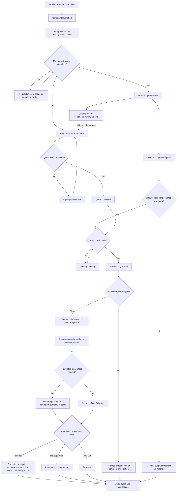

# Diagram - Complaint and Review v0

## Purpose

Show complaints as scoped formal review objects, distinct from ordinary comments.

Related resolutions: C004, C014, C024, H024.

## Rule

> Complaints must be easy to file, hard to ignore, and structured enough to review fairly. Review requires the configured support threshold, fiscalizer quote, and funded review path. Regulated operational effects require the competent authority or court where applicable.
