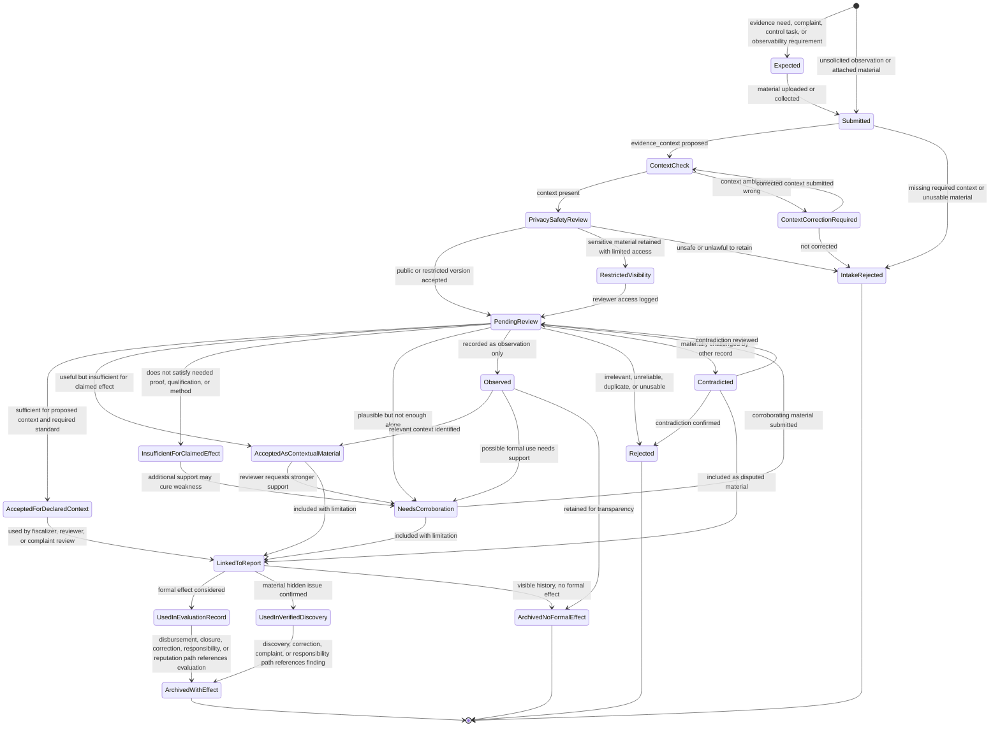
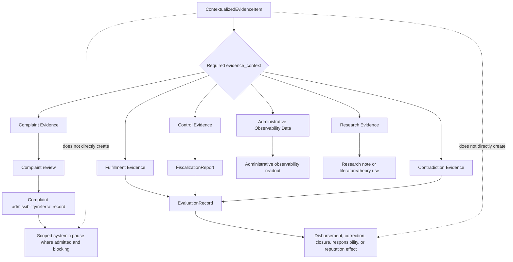

# Diagram - Contextualized Evidence Item State v0

## Purpose

Show the formal lifecycle of a `ContextualizedEvidenceItem`.

This diagram separates evidence submission from formal evaluation. A contextualized evidence item may support a complaint, fulfillment review, control review, contradiction, administrative observability, or research use, but it does not create disbursement, closure, responsibility, reputation, or legal effects by itself.

Source baseline:

- [[64_FORMAL_ENTITY_INVENTORY_V0|docs/64_FORMAL_ENTITY_INVENTORY_V0.md]]
- [[evidence-context-taxonomy-v0|knowledge/concepts/evidence-context-taxonomy-v0.md]]
- [[10_FISCALIZATION_EVIDENCE_AND_CONTROL_MODEL|docs/10_FISCALIZATION_EVIDENCE_AND_CONTROL_MODEL.md]]
- [[24_CITIZEN_EVIDENCE_PRODUCTION_FLOW|docs/24_CITIZEN_EVIDENCE_PRODUCTION_FLOW.md]]
- [[26_CITIZEN_COMPLAINT_FLOW|docs/26_CITIZEN_COMPLAINT_FLOW.md]]
- [[30_PROJECT_LIFECYCLE_AFTER_PUBLICATION_FLOW|docs/30_PROJECT_LIFECYCLE_AFTER_PUBLICATION_FLOW.md]]
- [[31_PROJECT_DISBURSEMENT_FLOW|docs/31_PROJECT_DISBURSEMENT_FLOW.md]]
- [[79_EVIDENCE_QUALITY_REVIEW_AND_A013_RESOLUTION|docs/79_EVIDENCE_QUALITY_REVIEW_AND_A013_RESOLUTION.md]]

Related sources: H008, H012, H015, H016, H018, H022, H023, H024, C002, C003, C004, C005, C013, C015, C016, C018, C024.

## Evidence Item Lifecycle



## Context and Effect Routing



## Context Rules

- A `ContextualizedEvidenceItem` requires `evidence_context` before it can be used for a formal effect.
- The same underlying source material may produce more than one contextualized evidence item or more than one reviewed context. Each formal use must be separately classified, reviewed, and auditable.
- `Complaint Evidence` supports, refutes, or contextualizes a complaint. It does not prove complaint merit or produce a project blocker by itself.
- `Fulfillment Evidence` is used to verify value floors, antivalue ceilings, metrics, milestones, phase gates, disbursement conditions, closure, or role-relevant accountability.
- Formal fulfillment/control evidence for hard KPIs must also satisfy the declared producer qualification and method/protocol standard before it can support a formal effect.
- `Control Evidence` is produced through fiscalization, technical review, evidence missions, admissibility review, or other control work. It may later support fulfillment review, complaint review, contradiction review, or verified discovery depending on accepted context.
- `Contradiction Evidence` challenges a material information claim, evidence item, report, or conclusion. It may trigger correction, corroboration, complaint review, extraordinary review, or verified discovery only after review.
- `Administrative Observability Data` audits the platform and transition process. It is not automatically complaint evidence or fulfillment evidence.
- `Research Evidence` belongs to the research project, not to the governance system's project-execution workflow.

## Formal Effect Rules

- Accepted evidence is not the same as formal evaluation. Formal effects require an `EvaluationRecord`, `FiscalizationReport`, `ComplaintAdmissibilityReferralRecord`, `SystemicPauseRecord`, `ProjectClosureAccountabilityRecord`, `ResponsibilityEvent`, or another scoped formal record.
- For hard technical KPIs, a contextualized evidence item is not accepted for the declared formal context unless producer qualification, method/protocol fit, instrument or tool basis, required metadata, and report limitations fit the relevant evidence need.
- Executor-submitted material is self-report unless corroborated by accepted non-executor evidence, fiscalizer review, beneficiary confirmation, technical record, or other valid source.
- Evidence accepted only as contextual material may remain visible and useful, but it cannot by itself release funds, close a milestone as fulfilled, prove a complaint, or update reputation.
- Contradicted or insufficient evidence is not proof of fraud by itself. It is also not proof of fulfillment.
- AI may flag missing metadata, privacy risk, duplicates, or contradictions, but AI does not decide truth, responsibility, fund release, legal effect, or reputation.

## Macul Example Trace

```text
Source material:
photo showing an incomplete multi-court surface.

Complaint Evidence context:
used to support a complaint alleging that the design/construction does not match the accepted baseline.

Fulfillment Evidence context:
reviewed against court dimensions, bathroom/accessibility commitments, public-access rules, construction milestone, or phase gate. A formal court-dimension KPI requires a qualified or otherwise protocol-idoneous producer, adequate measurement method, instrument basis, metadata, and report.

Control Evidence context:
if produced by an assigned field visit or fiscalization mission.

Possible result:
Accepted only as contextual material if the photo is dark, lacks location metadata, is not tied to a specific milestone, or cannot prove the hard KPI because the producer or method is not idoneous for that claimed effect.

Possible formal effect:
No construction disbursement release unless an EvaluationRecord or FiscalizationReport accepts sufficient fulfillment/control evidence for the relevant phase gate or milestone.
```

## Boundary With Other State Machines

This diagram does not replace the future diagrams for:

- complaint evidence and complaint review;
- funding commitment and disbursement;
- project evidential contract and fulfillment evidence needs;
- control subproject and fiscalization assignment.

Those diagrams should reference this evidence item lifecycle rather than recreating a generic `Evidence` node.

## Rule

> Evidence becomes operationally meaningful only when it is contextualized, reviewed for the claimed use, and linked to a scoped formal record. The platform must never let an undifferentiated evidence item create project, money, complaint, responsibility, or reputation effects directly.
