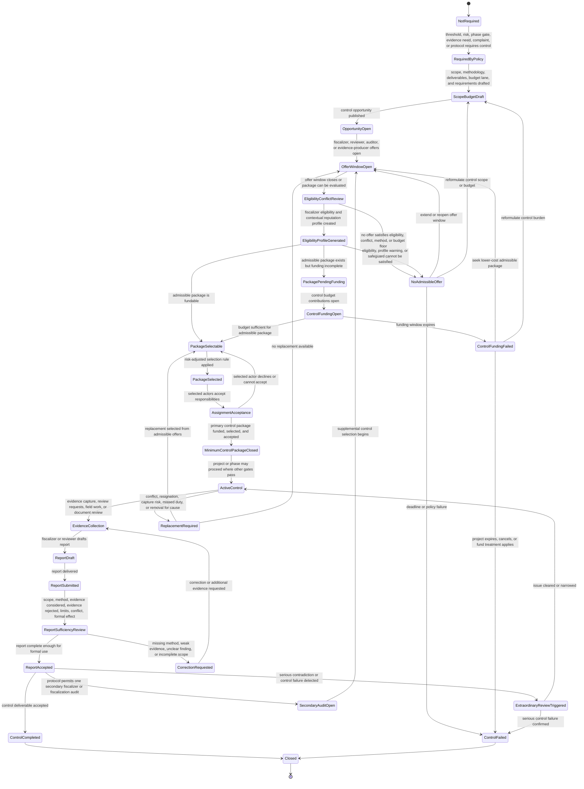
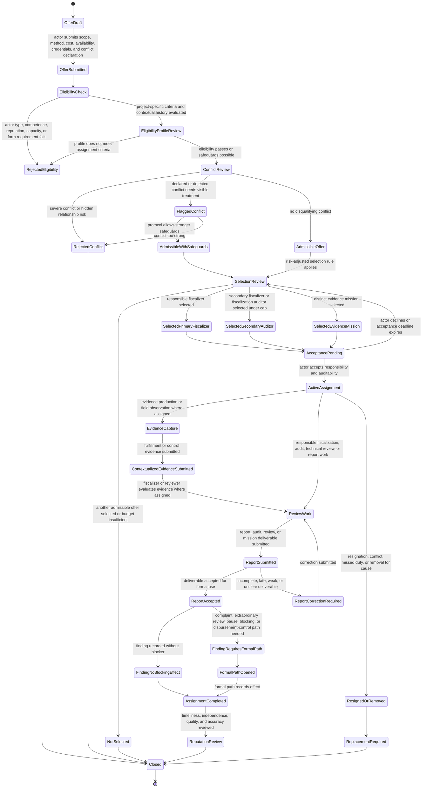
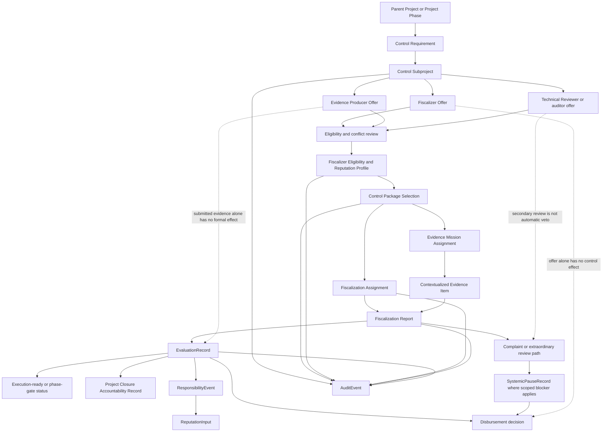

# Diagram - Control Subproject and Fiscalization Assignment State v0

## Purpose

Show how a `Control Subproject` and its `Fiscalization Assignment` move from required control into offers, selection, funding, assignment, evidence production, fiscalization reports, and formal effects.

This diagram separates:

- open observation;
- lightweight fiscalizer or evidence-producer offers;
- selected control work;
- responsible fiscalization;
- supplemental or secondary fiscalization;
- evidence production;
- fiscalization reports;
- formal evaluation effects.

A control subproject is project-like, but it is not an ordinary public-value project and is not selected by ordinary popularity or by the executor being reviewed.

Source baseline:

- `docs/40_CONTROL_SUBPROJECTS_AND_C002_RESOLUTION.md`
- `knowledge/hypotheses/H016-distributed-fiscalization-ecosystem.md`
- `docs/52_FISCALIZATION_OFFER_COST_AND_C013_RESOLUTION.md`
- `docs/23_CITIZEN_FISCALIZER_OFFER_FLOW.md`
- `docs/10_FISCALIZATION_EVIDENCE_AND_CONTROL_MODEL.md`
- `docs/24_CITIZEN_EVIDENCE_PRODUCTION_FLOW.md`
- `docs/64_FORMAL_ENTITY_INVENTORY_V0.md`
- `docs/diagrams/v0-project-evidential-contract-state.md`
- `docs/diagrams/v0-funding-commitment-disbursement-state.md`

Related sources: C002, C003, C013, C016, H008, H013, H015, H016, H018, H019, H022, H023, A003.

## Control Subproject State Machine

This state machine tracks the control package or control subproject for a parent project, phase, milestone, evidence mission, admissibility review, extraordinary review, or secondary fiscalization.



## Fiscalization Offer and Assignment State Machine

This state machine tracks an actor's offer and possible assignment. Submitting an offer does not make the actor responsible and does not create payment by itself.



## Control Effect Routing

This flowchart shows how control work affects project state, funding, closure, and reputation without giving uncontrolled veto power to offers, secondary reviewers, or raw evidence.



## State Rules

- A `Control Subproject` is attached to a parent `Project`, `ProjectPhase`, milestone, evidence need, complaint review, admissibility review, extraordinary review, or supplemental control need.
- Control work may be project-like, but it is selected under stronger independence rules than ordinary public-value projects.
- Execution funding, fiscalizer offers, evidence-producer offers, and control-cost discovery may proceed in parallel.
- The project does not become execution-ready until the execution budget and the minimum admissible control package are both closed where control is required.
- The executor may object to verifiable conflicts and respond to requests, but it cannot privately appoint, directly pay, remove, or control the fiscalizer or evidence producer who validates its own performance.
- Lightweight offers are unpaid by default. Payment begins only when an actor is selected or assigned to accepted control work under protocol rules.
- Low-risk projects may use simple admissible selection; medium-risk projects may use simple technical/economic scoring plus semi-random selection; high-risk projects may require stronger eligibility, conflict review, technical evaluation, and public justification.
- Responsible fiscalizer selection should expose a project-specific eligibility and reputation profile. This profile is contextual to the assignment and should not become a generic CV, universal score, or automatic selector.
- Core v0 permits at most one primary responsible fiscalizer and, where protocol permits and funding supports it, one secondary fiscalizer or fiscalization auditor.
- Secondary fiscalization audits the primary fiscalization. It does not replace the primary fiscalizer and does not automatically block execution or disbursement.
- Serious findings from control work must enter a formal path: complaint, extraordinary review, correction, scoped pause, disbursement block, reformulation, responsibility review, or closure effect.

## Macul Example Trace

```text
Parent project:
Design and Construction of Multi-Courts in Macul

Required control:
Design phase gate review and construction milestone fiscalization.

Control subproject:
Review design package against declared dimensions, public access, bathrooms or accessibility commitments where promised or required, budget refinement, and construction evidence needs.

Offer process:
Fiscalizers submit methodology, cost, availability, credentials, workload, comparable-project experience, repeat relationships, and conflict declarations.

Selection:
The executor may disclose concerns but cannot choose the fiscalizer.
Protocol selects an admissible independent fiscalizer after the project-specific eligibility and reputation profile is reviewed.

Execution-ready effect:
Construction funding may be reserved, but construction execution and release remain blocked until the design gate and the minimum control package are accepted.

Secondary fiscalizer:
If later funded and allowed, it may audit the primary fiscalizer's conclusion.
If it detects wrong dimensions or locked public-access gates, that finding must enter a formal path before blocking funds or creating reputation consequences.
```

## Boundary With Other State Machines

This diagram does not replace:

- the project and phase state diagram;
- the Project Evidential Contract and Fulfillment Evidence Need state diagram;
- the contextualized evidence item state diagram;
- the complaint evidence and review state diagram;
- the funding and disbursement state diagram.

It defines how control actors are selected and assigned before their reports can affect those other objects.

## Rule

> Fiscalization is distributed in supply but protocol-selected in responsibility. Control work must be independent enough to matter, simple enough to operate, capped enough to avoid harassment, and auditable enough to create consequences when fiscalization itself fails.
