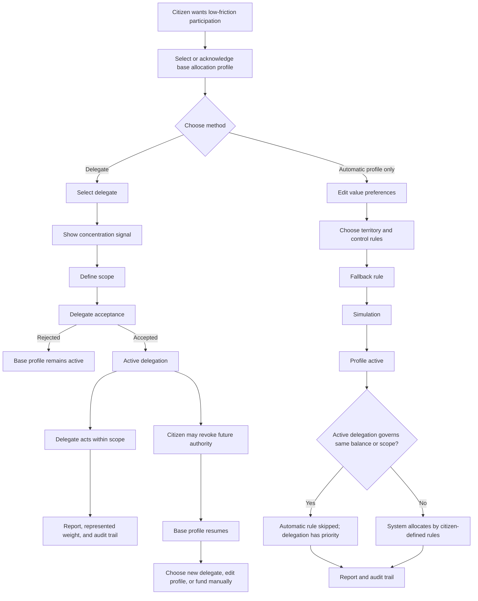

# Diagram - Delegation and Automatic Allocation v0

## Purpose

Show the relationship between delegation and automatic allocation, including base-profile continuity, delegation priority, concentration visibility, and revocation.

Related resolutions: C011, C023. Related hypotheses: H047, H048, H049.

## Rule

> Delegation authorizes another actor and has priority within its scope. Budget delegation requires a selected or acknowledged base allocation profile before activation. Automatic allocation applies citizen-defined rules only where no active delegation governs the same balance or scope. If delegation is revoked, rejected, expired, or resigned, the previously selected base rule resumes for future allocation.
