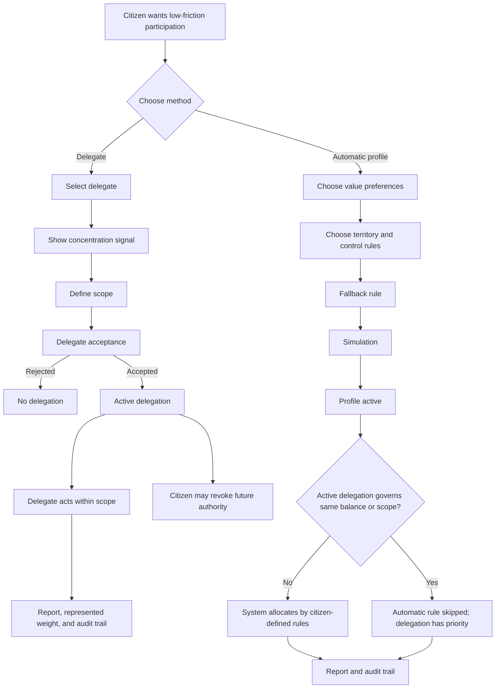

# Diagram - Delegation and Automatic Allocation v0

## Purpose

Show the relationship between delegation and automatic allocation, including delegation priority and concentration visibility.

Related resolutions: C011, C023.

## Rule

> Delegation authorizes another actor and has priority within its scope. Automatic allocation applies citizen-defined rules only where no active delegation governs the same balance or scope.
