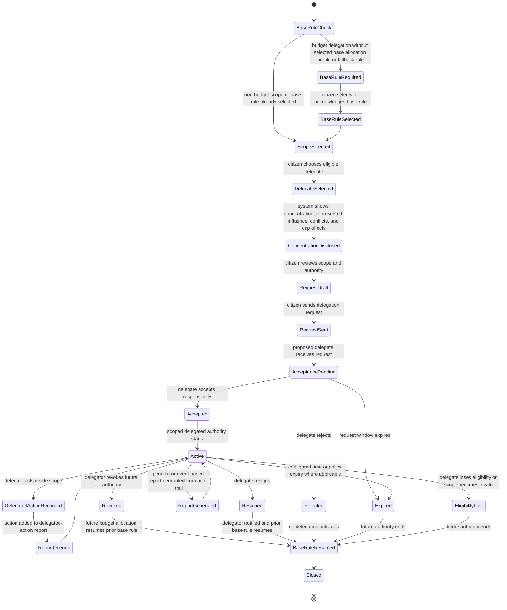
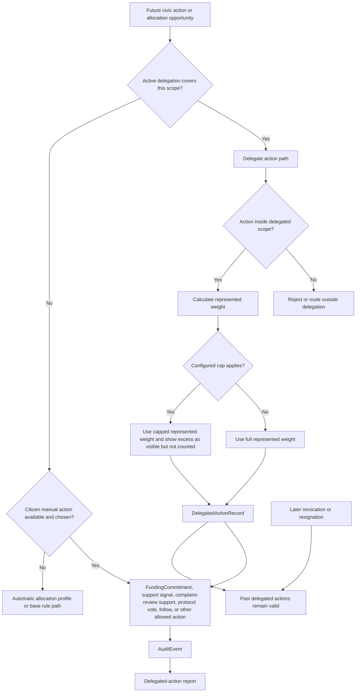
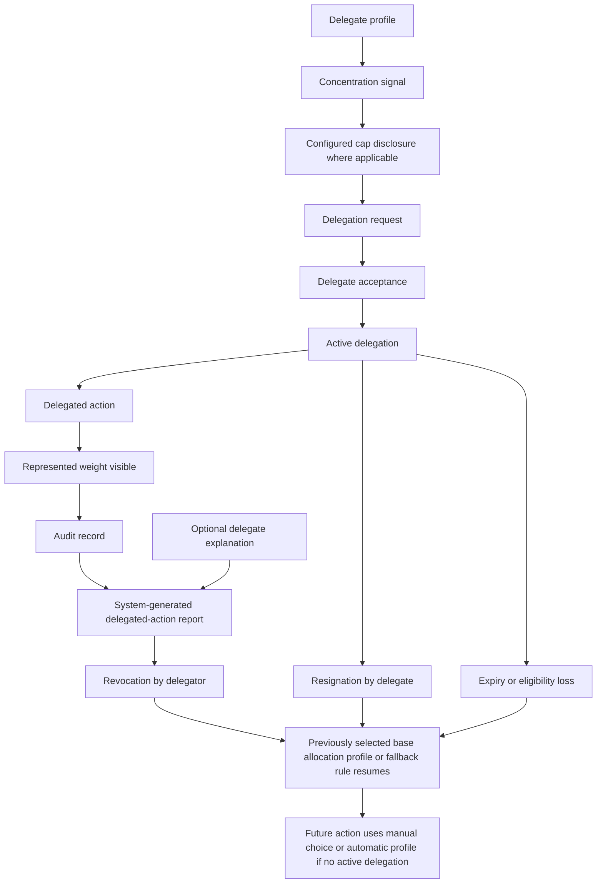

# Diagram - Delegation State v0

## Purpose

Show how `Delegation` moves from citizen intent into delegate acceptance, active scoped authority, represented-weight actions, reporting, revocation, resignation, expiry, and fallback activation.

Delegation is scoped authorization. It is not a transfer of citizenship, identity, money ownership, unlimited authority, automatic compensation, or automatic allocation.

Source baseline:

- [[27_CITIZEN_DELEGATION_FLOW|docs/27_CITIZEN_DELEGATION_FLOW.md]]
- [[28_CITIZEN_AUTOMATIC_ALLOCATION_PROFILE_FLOW|docs/28_CITIZEN_AUTOMATIC_ALLOCATION_PROFILE_FLOW.md]]
- [[50_DELEGATION_PRIORITY_AND_C011_RESOLUTION|docs/50_DELEGATION_PRIORITY_AND_C011_RESOLUTION.md]]
- [[61_DELEGATION_CONCENTRATION_VISIBILITY_AND_C023_RESOLUTION|docs/61_DELEGATION_CONCENTRATION_VISIBILITY_AND_C023_RESOLUTION.md]]
- [[H042-layered-delegation-architecture|knowledge/hypotheses/H042-layered-delegation-architecture.md]]
- [[H043-transparent-delegation-concentration|knowledge/hypotheses/H043-transparent-delegation-concentration.md]]
- [[H045-delegated-action-weight|knowledge/hypotheses/H045-delegated-action-weight.md]]
- [[H046-delegated-action-reporting|knowledge/hypotheses/H046-delegated-action-reporting.md]]
- [[H047-immediate-delegation-revocation|knowledge/hypotheses/H047-immediate-delegation-revocation.md]]
- [[H048-delegation-request-and-acceptance|knowledge/hypotheses/H048-delegation-request-and-acceptance.md]]
- [[H049-delegate-resignation-and-notification|knowledge/hypotheses/H049-delegate-resignation-and-notification.md]]
- [[64_FORMAL_ENTITY_INVENTORY_V0|docs/64_FORMAL_ENTITY_INVENTORY_V0.md]]

Related sources: C005, C007, C008, C011, C023, H033, H034, H038, H042-H049.

## Delegation State Machine

This state machine tracks a delegation relationship between a delegator and a proposed delegate for a defined scope.



## Delegated Action and Priority Routing

This flowchart shows how the system decides whether a future action is governed by delegation, manual choice, or an automatic allocation profile.



## Concentration, Reporting, and Fallback Routing

This flowchart shows the accountability loop around delegation concentration and termination.



## State Rules

- Delegation is voluntary and scoped.
- Budget delegation cannot become active until the citizen has selected or acknowledged a base allocation profile or fallback rule.
- Delegation requires delegate acceptance. A pending request creates no authority.
- Active delegation has priority over automatic allocation within the delegated scope.
- Automatic allocation profiles remain stored but inactive or skipped where active delegation governs the same scope.
- Delegated actions must record scope, represented weight, delegate identity, delegated action type, cap effects where applicable, and audit reference.
- Delegation concentration is allowed by default, but it must be visible before delegation, during delegated action, in reports, and in observability.
- A010 stress thresholds are warning, report-sufficiency, disclosure, and observability conditions over existing delegation records, not new delegation states or a universal cap.
- Core v0 does not impose a universal hard cap. If a cap exists, it must be configured and visible before it affects delegation.
- Revocation is immediate for future authority and non-retroactive.
- Delegate resignation is allowed and affects only future authority.
- Rejection, revocation, resignation, expiry, or eligibility loss resumes the citizen's previously selected base rule for future budget allocation.
- Valid delegated funding actions remain funding commitments under ordinary funding rules; revoking delegation does not create a free withdrawal right.
- Core v0 has no separate pause state for delegation. The simple path is revoke and later create a new delegation if desired.
- Delegation does not create automatic delegate compensation. Participation-support projects, if any, must be ordinary transparent projects.
- AI assistance is not a delegate, and public authorities are not internal delegates in scopes they control.

## Macul Sports Example Trace

```text
Citizen:
Ana

Base rule:
Public system default profile accepted.

Delegation scope:
Sports allocation in Macul.

Delegate:
Macul Sports Association.

Before request:
The system shows that the association represents 2,430 citizens and 28% of delegated sports allocation in Macul.

Request:
Ana sends delegation request.

Acceptance:
The association accepts.

Active effect:
Automatic allocation is inactive for Ana's sports allocation in Macul while the delegation remains active.

Delegated action:
The association funds a Macul sports project.

Action record:
represented weight = association's own action + covered delegators.
scope = sports allocation in Macul.
cap effect = shown if any protocol cap applies.

Report:
Ana receives a system-generated delegated-action summary.

Revocation:
Ana revokes delegation.
Future sports allocation returns to the public system default profile.
Past valid delegated funding remains governed by funding commitment, project failure, return, reassignment, recovery, and closure rules.
```

## Boundary With Other State Machines

This diagram does not replace:

- the automatic allocation profile flow;
- the funding commitment and disbursement state diagram;
- the project state diagram;
- the governance or protocol-change state diagrams.

It defines when delegated authority exists and how delegated action records feed those other objects.

## Rule

> Delegation increases participation capacity only if authority remains scoped, accepted, visible, reportable, concentration-aware, immediately revocable for future actions, and backed by an explicit fallback rule when budget allocation is delegated.
