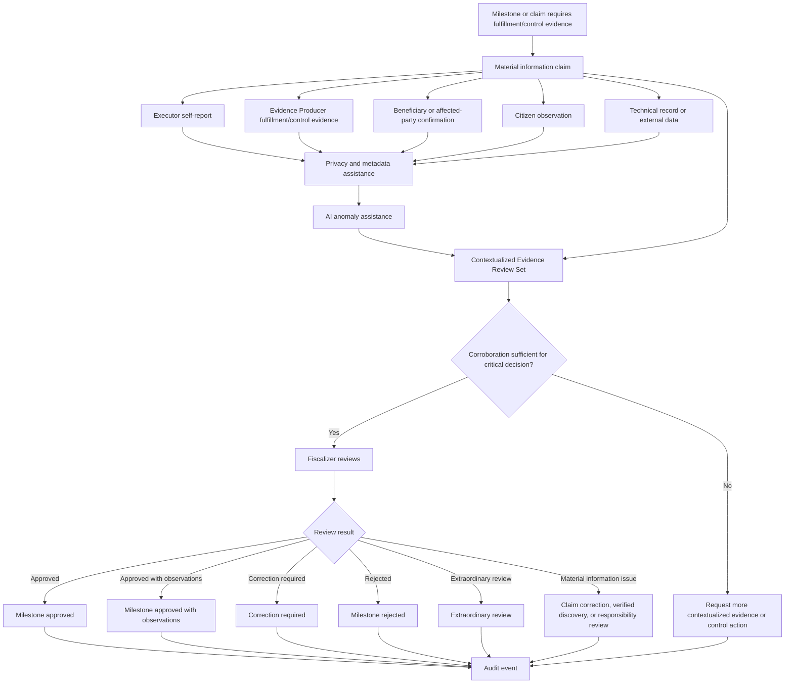

# Diagram - Contextualized Evidence and Fiscalization v0

## Purpose

Show how contextualized evidence enters review, how executor self-report is separated from corroborated non-executor evidence, and how material information claims can lead to correction, verified discovery, or responsibility review.

Related resolutions: C002, C003, C015, H023.

## Rule

> Evidence producers create verifiable fulfillment/control material. Executor material is self-report unless corroborated. Fiscalizers evaluate compliance after contextualized evidence exists. AI may flag anomalies, but verified discovery, responsibility, and fund effects require review.
