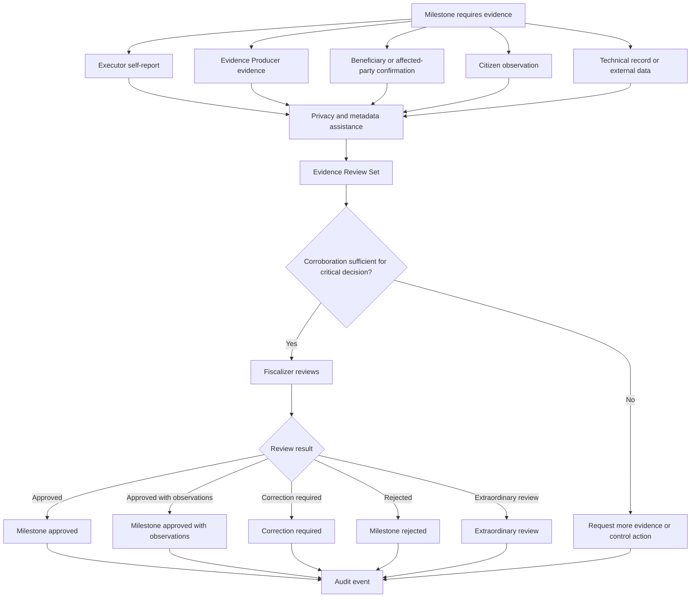

# Diagram - Evidence and Fiscalization v0

## Purpose

Show how evidence enters review and how executor self-report is separated from corroborated non-executor evidence.

Related resolutions: C002, C003, C015.

## Rule

> Evidence producers create verifiable material. Executor material is self-report unless corroborated. Fiscalizers evaluate compliance after evidence exists.
