# Diagram - Formal Entity Relationship Baseline v0

## Purpose

Show the primary entity relationships that should guide Phase 2 formal modeling.

This diagram is a conceptual ERD baseline, not a database schema. It focuses on the relationships needed to preserve accountability: actor, role, project, value promise, evidence context, fiscalization, funding, complaint handling, closure, reputation, governance, and audit traceability.

Source baseline: `docs/64_FORMAL_ENTITY_INVENTORY_V0.md`.

Related sources: `docs/35_CONSOLIDATED_ENTITY_OBJECT_STATE_MAP.md`, H001-H003, H008, H012-H019, H022-H024, C001-C025.

```mermaid
erDiagram
    ACTOR {
        string actor_id
        string actor_type
        string verification_status
    }

    ROLE_ASSIGNMENT {
        string role_assignment_id
        string role_type
        string scope
        string status
    }

    PROJECT {
        string project_id
        string current_state
        string operating_scope
    }

    PROJECT_VERSION {
        string project_version_id
        string version_status
    }

    PROJECT_PHASE {
        string project_phase_id
        string phase_type
        string phase_state
    }

    PLANNING_SCOPE {
        string planning_scope_id
        string source
        string status
    }

    OPERATING_MODE {
        string operating_mode_id
        string mode
    }

    THRESHOLD_POLICY {
        string threshold_policy_id
        string burden_profile
        string source
    }

    PRIMARY_RESPONSIBILITY_ANCHOR {
        string anchor_id
        string public_function
    }

    VALUE_THESIS {
        string value_thesis_id
        string status
    }

    VALUE_ANTIVALUE_PROFILE {
        string profile_id
        string status
    }

    VALUE_VERIFICATION_PACKAGE {
        string package_id
        string verification_scope
    }

    PROJECT_EVIDENTIAL_CONTRACT {
        string contract_id
        string validation_status
    }

    FULFILLMENT_EVIDENCE_NEED {
        string need_id
        string need_context
        string status
    }

    CONTEXTUALIZED_EVIDENCE_ITEM {
        string evidence_item_id
        string evidence_context
        string review_status
        string sufficiency_status
    }

    EVIDENCE_CONTEXT {
        string context_id
        string context_type
    }

    MATERIAL_INFORMATION_CLAIM {
        string claim_id
        string claim_status
    }

    EVALUATION_RECORD {
        string evaluation_record_id
        string evaluated_dimension
        string formal_effect
    }

    FISCALIZATION_REQUIREMENT {
        string requirement_id
        string control_depth
    }

    CONTROL_SUBPROJECT {
        string control_subproject_id
        string control_type
        string status
    }

    FISCALIZATION_ASSIGNMENT {
        string assignment_id
        string assignment_scope
        string status
    }

    FISCALIZATION_REPORT {
        string report_id
        string report_status
    }

    BUDGET {
        string budget_id
        string budget_status
    }

    FUNDING_COMMITMENT {
        string commitment_id
        string commitment_state
    }

    CIVIC_WALLET {
        string wallet_id
        string allocation_scope
    }

    FINANCIAL_ORDER {
        string financial_order_id
        string order_type
        string status
    }

    CUSTODIAN {
        string custodian_id
        string custodian_type
    }

    DISBURSEMENT {
        string disbursement_id
        string disbursement_state
    }

    FINANCIAL_ASSURANCE_PROFILE {
        string assurance_profile_id
        string assurance_rule
    }

    GUARANTEE_MATERIALIZATION_RECORD {
        string guarantee_record_id
        string confirmation_status
    }

    COMPLAINT {
        string complaint_id
        string complaint_state
    }

    COMPLAINT_REVIEW_POLICY {
        string policy_id
        string activation_rule
    }

    COMPLAINT_REVIEW_QUOTE {
        string quote_id
        string quote_status
    }

    COMPLAINT_ADMISSIBILITY_REFERRAL_RECORD {
        string record_id
        string admissibility_status
    }

    SYSTEMIC_PAUSE_RECORD {
        string pause_record_id
        string affected_scope
        string pause_state
    }

    PROJECT_CLOSURE_ACCOUNTABILITY_RECORD {
        string closure_record_id
        string closure_status
    }

    RESPONSIBILITY_EVENT {
        string responsibility_event_id
        string event_type
    }

    REPUTATION_INPUT {
        string reputation_input_id
        string source_type
    }

    REPUTATION_UPDATE {
        string reputation_update_id
        string role_affected
    }

    REPUTATION_SUMMARY {
        string reputation_summary_id
        string visible_scope
    }

    PERFORMANCE_HISTORY_SURFACE {
        string performance_surface_id
        string role_scope
    }

    DELEGATION {
        string delegation_id
        string delegation_scope
        string status
    }

    AUTOMATIC_ALLOCATION_PROFILE {
        string profile_id
        string profile_status
    }

    GOVERNANCE_RESOLUTION {
        string resolution_id
        string decision_type
    }

    REVIEW_TIMEOUT_RESOLUTION {
        string timeout_resolution_id
        string timeout_effect
    }

    PROTOCOL_VERSION {
        string protocol_version_id
        string effective_status
    }

    ADMINISTRATIVE_RULE_CHANGE {
        string rule_change_id
        string affected_rule
    }

    SYSTEM_IMPLEMENTATION_CHANGE {
        string implementation_change_id
        string affected_component
    }

    AUDIT_EVENT {
        string audit_event_id
        string event_type
        string object_type
    }

    ACTOR ||--o{ ROLE_ASSIGNMENT : holds
    ROLE_ASSIGNMENT }o--|| PROJECT : scoped_to
    ROLE_ASSIGNMENT ||--o{ AUDIT_EVENT : records

    PLANNING_SCOPE ||--o{ PROJECT : governs
    OPERATING_MODE ||--o{ PLANNING_SCOPE : configures
    THRESHOLD_POLICY ||--o{ PROJECT : constrains
    PROTOCOL_VERSION ||--o{ THRESHOLD_POLICY : governs
    PROJECT ||--|| PRIMARY_RESPONSIBILITY_ANCHOR : has
    PROJECT ||--o{ PROJECT_VERSION : versions
    PROJECT ||--o{ PROJECT_PHASE : phases

    PROJECT ||--|| VALUE_THESIS : declares
    PROJECT ||--|| VALUE_ANTIVALUE_PROFILE : defines
    VALUE_THESIS ||--o{ VALUE_VERIFICATION_PACKAGE : contains
    VALUE_ANTIVALUE_PROFILE ||--o{ VALUE_VERIFICATION_PACKAGE : constrains
    VALUE_VERIFICATION_PACKAGE ||--o{ FULFILLMENT_EVIDENCE_NEED : defines
    PROJECT ||--|| PROJECT_EVIDENTIAL_CONTRACT : requires
    PROJECT_EVIDENTIAL_CONTRACT ||--o{ FULFILLMENT_EVIDENCE_NEED : defines
    PROJECT_PHASE ||--o{ FULFILLMENT_EVIDENCE_NEED : may_require

    PROJECT ||--o{ MATERIAL_INFORMATION_CLAIM : contains
    MATERIAL_INFORMATION_CLAIM ||--o{ CONTEXTUALIZED_EVIDENCE_ITEM : supported_or_contradicted_by
    FULFILLMENT_EVIDENCE_NEED ||--o{ CONTEXTUALIZED_EVIDENCE_ITEM : addressed_by
    EVIDENCE_CONTEXT ||--o{ CONTEXTUALIZED_EVIDENCE_ITEM : classifies
    CONTEXTUALIZED_EVIDENCE_ITEM ||--o{ EVALUATION_RECORD : used_in
    EVALUATION_RECORD ||--o{ RESPONSIBILITY_EVENT : may_create

    PROJECT ||--|| FISCALIZATION_REQUIREMENT : has
    PROJECT ||--o{ CONTROL_SUBPROJECT : has_control_work
    CONTROL_SUBPROJECT ||--o{ FISCALIZATION_ASSIGNMENT : assigns
    ROLE_ASSIGNMENT ||--o{ FISCALIZATION_ASSIGNMENT : performs
    FISCALIZATION_ASSIGNMENT ||--o{ FISCALIZATION_REPORT : produces
    FISCALIZATION_REPORT ||--o{ EVALUATION_RECORD : supports
    CONTEXTUALIZED_EVIDENCE_ITEM ||--o{ FISCALIZATION_REPORT : considered_by

    PROJECT ||--|| BUDGET : has
    CIVIC_WALLET ||--o{ FUNDING_COMMITMENT : commits
    FUNDING_COMMITMENT }o--|| PROJECT : funds
    FUNDING_COMMITMENT }o--o| CONTROL_SUBPROJECT : may_fund_control
    PROJECT ||--o{ DISBURSEMENT : receives
    PROJECT_PHASE ||--o{ DISBURSEMENT : gates
    EVALUATION_RECORD ||--o{ DISBURSEMENT : may_authorize_or_block
    DISBURSEMENT ||--o{ FINANCIAL_ORDER : generates
    FINANCIAL_ORDER }o--|| CUSTODIAN : executed_by
    PROJECT ||--|| FINANCIAL_ASSURANCE_PROFILE : may_require
    FINANCIAL_ASSURANCE_PROFILE ||--o{ GUARANTEE_MATERIALIZATION_RECORD : confirmed_by
    GUARANTEE_MATERIALIZATION_RECORD ||--o{ DISBURSEMENT : gates_release

    PROJECT ||--o{ COMPLAINT : may_receive
    ROLE_ASSIGNMENT ||--o{ COMPLAINT : files
    COMPLAINT_REVIEW_POLICY ||--o{ COMPLAINT : governs
    COMPLAINT ||--o{ COMPLAINT_REVIEW_QUOTE : priced_by
    COMPLAINT ||--o{ COMPLAINT_ADMISSIBILITY_REFERRAL_RECORD : reviewed_as
    COMPLAINT ||--o{ CONTEXTUALIZED_EVIDENCE_ITEM : includes_complaint_evidence
    COMPLAINT_ADMISSIBILITY_REFERRAL_RECORD ||--o{ SYSTEMIC_PAUSE_RECORD : may_trigger
    SYSTEMIC_PAUSE_RECORD }o--|| PROJECT : affects_scope

    PROJECT ||--o{ PROJECT_CLOSURE_ACCOUNTABILITY_RECORD : closes_with
    PROJECT_CLOSURE_ACCOUNTABILITY_RECORD ||--o{ EVALUATION_RECORD : includes
    PROJECT_CLOSURE_ACCOUNTABILITY_RECORD ||--o{ FISCALIZATION_REPORT : includes
    PROJECT_CLOSURE_ACCOUNTABILITY_RECORD ||--o{ RESPONSIBILITY_EVENT : may_create
    RESPONSIBILITY_EVENT ||--o{ REPUTATION_INPUT : reviewed_as
    REPUTATION_INPUT ||--o{ REPUTATION_UPDATE : applies
    REPUTATION_UPDATE ||--o{ REPUTATION_SUMMARY : summarized_in
    PROJECT_CLOSURE_ACCOUNTABILITY_RECORD ||--o{ PERFORMANCE_HISTORY_SURFACE : feeds
    REPUTATION_SUMMARY ||--o{ PERFORMANCE_HISTORY_SURFACE : informs

    ACTOR ||--o{ DELEGATION : grants_or_accepts
    DELEGATION ||--o{ FUNDING_COMMITMENT : may_authorize
    ACTOR ||--o{ AUTOMATIC_ALLOCATION_PROFILE : owns
    AUTOMATIC_ALLOCATION_PROFILE ||--o{ FUNDING_COMMITMENT : may_generate

    OPERATING_MODE ||--o{ GOVERNANCE_RESOLUTION : produces
    OPERATING_MODE ||--o{ REVIEW_TIMEOUT_RESOLUTION : produces
    GOVERNANCE_RESOLUTION ||--o{ PLANNING_SCOPE : may_interpret
    REVIEW_TIMEOUT_RESOLUTION ||--o{ PROJECT : may_affect
    ADMINISTRATIVE_RULE_CHANGE ||--o{ PROTOCOL_VERSION : updates
    SYSTEM_IMPLEMENTATION_CHANGE ||--o{ PROTOCOL_VERSION : implements
    PROTOCOL_VERSION ||--o{ AUDIT_EVENT : referenced_by

    PROJECT ||--o{ AUDIT_EVENT : records
    CONTEXTUALIZED_EVIDENCE_ITEM ||--o{ AUDIT_EVENT : records
    COMPLAINT ||--o{ AUDIT_EVENT : records
    FUNDING_COMMITMENT ||--o{ AUDIT_EVENT : records
    DISBURSEMENT ||--o{ AUDIT_EVENT : records
    GOVERNANCE_RESOLUTION ||--o{ AUDIT_EVENT : records
```



## Modeling notes

- `RoleAssignment` is used as the ERD bridge between actor identity, contextual role, and project scope. It represents the traceable fact that an actor holds a role in a specific context.
- `ContextualizedEvidenceItem` is the technical evidence record. Formal effects depend on `EvidenceContext`, review status, corroboration, and an effect-specific `EvaluationRecord`.
- `PerformanceHistorySurface`, `ReputationSummary`, and `AssistedDeliberationContext` are derived read models. This ERD shows `PerformanceHistorySurface` only where reviewed records feed it.
- Financial custody is external infrastructure. `Custodian` executes valid `FinancialOrder` records; it does not decide civic value, project priority, or fulfillment.
- Legal consequences remain outside the platform unless a country implementation grants legal effect. The ERD records platform effects and references external authority effects where applicable.

## Macul example trace

```text
Actor as Proposer/Modeler
-> Project
-> Project Phase: Design
-> Project Evidential Contract
-> Fulfillment Evidence Need
-> Contextualized Evidence Item with evidence_context
-> Evaluation Record / Fiscalization Report
-> Disbursement, Systemic Pause, Closure, Responsibility, or Reputation effect
```

## Rule

> The first ERD is a primary relationship baseline. It should expose missing accountability relationships before state diagrams are drafted, but it should not become a full database schema or include every derived citizen-facing surface.
