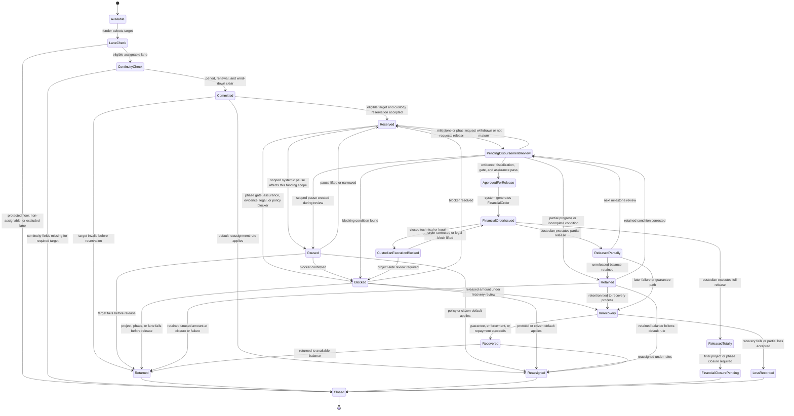
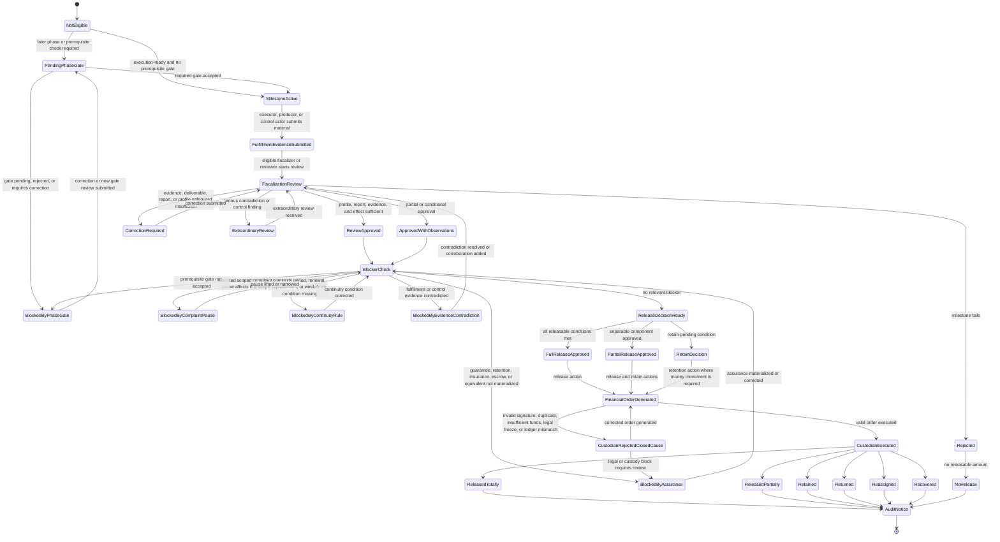
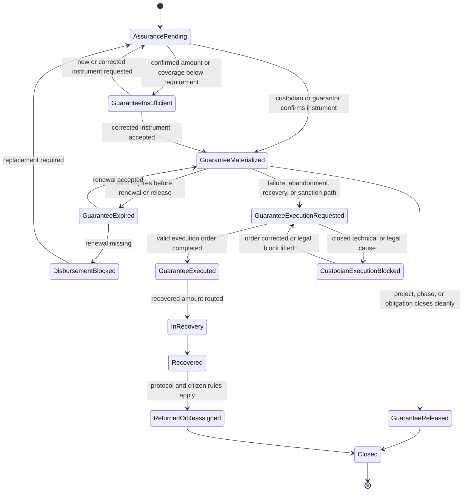

# Diagram - Funding Commitment and Disbursement State v0

## Purpose

Show the formal lifecycles of `FundingCommitment`, `Disbursement`, and `FinancialAssurance` without collapsing them into a single "funded" state.

This diagram refines the older funding-disbursement flow. It separates citizen funding commitment, reserved phase lanes, retained funds, disbursement review, financial orders, custodian execution, guarantee materialization, recovery, return, reassignment, and closure.

Source baseline:

- `docs/21_CITIZEN_FUNDING_FLOW.md`
- `docs/31_PROJECT_DISBURSEMENT_FLOW.md`
- `docs/42_FUNDING_COMMITMENT_AND_C005_RESOLUTION.md`
- `docs/69_FISCALIZER_QUALITY_CAPTURE_INDICATORS_AND_A003_RESOLUTION.md`
- `docs/71_ESSENTIAL_SERVICE_PROTECTION_AND_A005_RESOLUTION.md`
- `docs/72_CONTINUITY_RISK_CLASSIFICATION_AND_A006_RESOLUTION.md`
- `docs/47_TREASURY_CITIZEN_BALANCE_AND_C006_RESOLUTION.md`
- `docs/64_FORMAL_ENTITY_INVENTORY_V0.md`
- `docs/diagrams/v0-project-object-state-with-phase-substates.md`
- `docs/diagrams/v0-complaint-evidence-and-review-state.md`

Related sources: H008, H011, H013, H016, H019, H022, H024, H036, H037, C005, C006, C016, A005, A006.

## Funding Commitment State Machine

This state machine tracks the committed amount or funding lane. It does not decide whether the project has fulfilled its value thesis.



## Disbursement State Machine

This state machine tracks a disbursement request or disbursement decision for a phase, milestone, budget line, or retained amount.



## Financial Assurance and Guarantee State Machine

This state machine tracks the assurance instrument. It is not construction-specific; the same pattern can apply to care services, school-supply purchases, workshops, health support, infrastructure, or any execution-financeable social project.



## State Rules

- `Committed` means the funder made a serious funding commitment. It is not ordinary support and is not freely withdrawable.
- `LaneCheck` means the system verifies that the target is an eligible assignable lane. Ordinary civic-wallet funding cannot enter non-assignable protected floors or excluded lanes.
- `ContinuityCheck` means the system verifies A006 labels where the target is recurring, continuity-critical, emergency, or maintenance-dependent. A funding commitment should not imply indefinite service when it funds only a bounded period, and a renewal window should not automatically renew the current executor.
- `Reserved` means the amount is held for a project, phase lane, control package, complaint-review cost, mitigation activity, or other eligible public-purpose vehicle. It is not released to the executor.
- `Paused` means a scoped systemic pause affects the relevant funding, disbursement, milestone, phase, budget line, evidence item, or actor relationship. It is platform scope, not necessarily material or legal suspension.
- `Blocked` means a release cannot proceed until a named blocker is resolved.
- `Retained` means funds remain held after partial progress, incomplete evidence, correction need, guarantee rule, complaint-linked risk, or closure condition.
- `ApprovedForRelease` means the platform may generate a `FinancialOrder`; it does not mean the custodian has executed the payment.
- `CustodianExecutionBlocked` is limited to closed technical or legal causes. The custodian does not decide civic value, project priority, evidence validity, fiscalization, or discretionary disbursement.
- `ReleasedPartially` is allowed only when the disbursement milestone plan defines separable components, accepted evidence for completed components, retained amount, release condition, fiscalizer explanation, and citizen-facing summary.
- `Returned`, `Reassigned`, and `Recovered` are protocol/citizen-rule outcomes for unused, unreleased, retained, guaranteed, or recovered funds. They are not ordinary withdrawal by personal regret.
- `GuaranteeMaterialized` requires external confirmation by a custodian, guarantor, insurer, treasury, bank, escrow provider, or lawful equivalent. An uploaded executor document is not enough.

## Macul Example Trace

```text
Project:
Design and Construction of Multi-Courts in Macul

Citizen funds construction while design is pending:
Available -> Committed -> Reserved

Construction disbursement:
NotEligible -> PendingPhaseGate -> BlockedByPhaseGate

Reason:
The design phase gate has not been accepted.

If the design is accepted and financial assurance is materialized:
BlockedByPhaseGate -> PendingPhaseGate -> MilestoneActive -> FiscalizationReview -> ReleaseDecisionReady

If the design omits bathrooms, changes court dimensions, or materially weakens public access:
BlockedByPhaseGate remains active, or the project/phase enters correction, reformulation, return, reassignment, or reconfirmation under the active policy. Construction funds are not freely withdrawable, but they also cannot be released for construction while the design baseline fails.

If an admitted complaint affects only the disputed construction budget line:
Reserved -> Paused or Blocked only for that affected scope.
Unrelated scopes continue if their gates, evidence, assurance, and fiscalization conditions are satisfied.

Continuity example:
An older-adult home-care project funds months 1-6.
Before month 6, the continuity renewal window may generate an Idea for a follow-on service period.
Funding the follow-on project passes through LaneCheck and ContinuityCheck again.
The current provider may apply, but no state transition grants automatic renewal.
```

## Boundary With Other State Machines

This diagram does not replace:

- the project and phase state diagram;
- the contextualized evidence item state diagram;
- the complaint evidence and review state diagram;
- the future control subproject and fiscalization assignment diagram.

Funding and disbursement states change only through explicit records: phase gates, fulfillment/control evidence review, fiscalization reports, evaluation records, systemic pause records, financial assurance confirmation, financial orders, custodian execution status, closure accountability, recovery records, and audit events.

## Rule

> Funding is commitment, reservation is not release, release requires evidence, eligible fiscalization, sufficient report basis, and A006 continuity treatment where applicable; guarantees require external materialization, custodian execution is technical/legal rather than civic judgment, and unused or recovered funds follow protocol and citizen rules instead of ordinary withdrawal.
