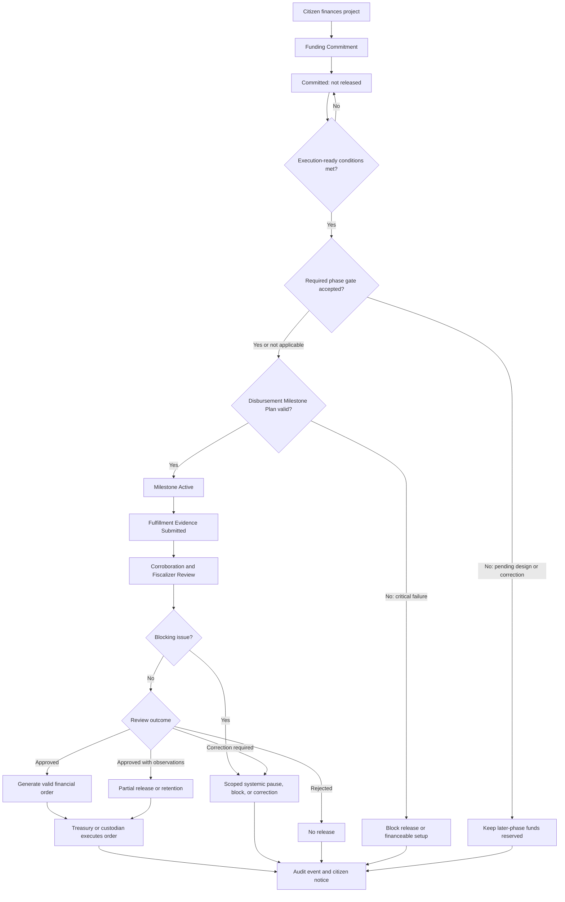

# Diagram - Funding and Disbursement v0

## Purpose

Show that citizen funding is a commitment and that disbursement is conditional release through milestone, fulfillment evidence, fiscalization, and custody rules.

Related resolutions: C005, C006, C016, H019.

## Rule

> Funding is commitment. Later-phase funds may be reserved before a phase gate is accepted, but they are not released until the gate passes. A complaint or review blocker must identify affected scope and any systemic pause. Treasury or custody executes protocol-valid orders, but does not decide civic value, project priority, fulfillment evidence validity, or discretionary disbursement.
