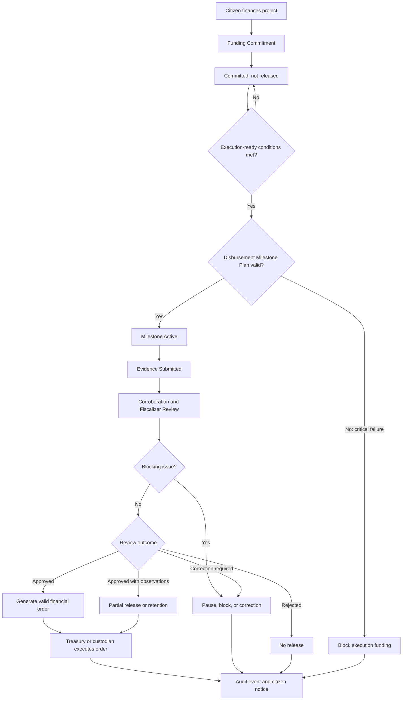

# Diagram - Funding and Disbursement v0

## Purpose

Show that citizen funding is a commitment and that disbursement is conditional release through milestone, evidence, fiscalization, and custody rules.

Related resolutions: C005, C006, C016.

## Rule

> Funding is commitment. Treasury or custody executes protocol-valid orders, but does not decide civic value, project priority, evidence validity, or discretionary disbursement.
