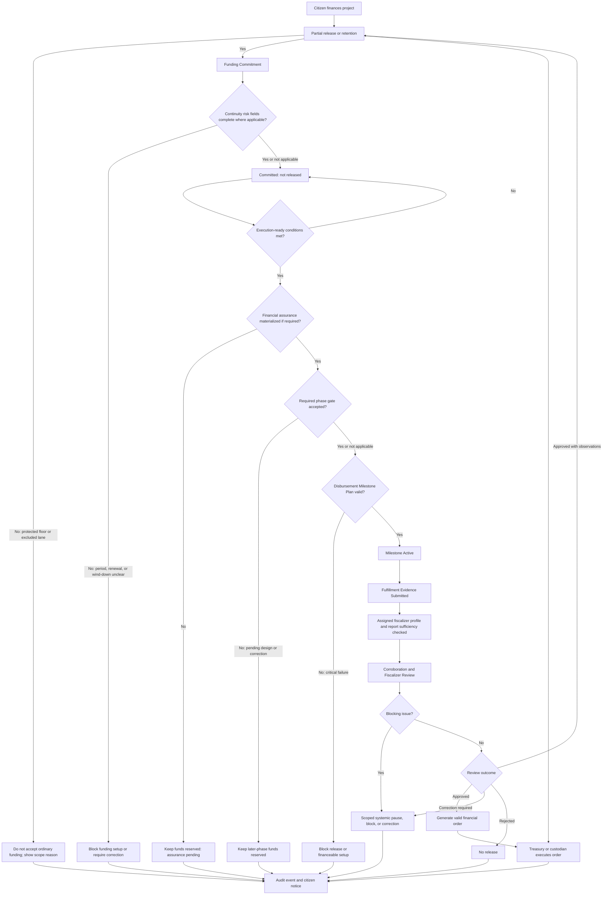

# Diagram - Funding and Disbursement v0

## Purpose

Show that citizen funding is a commitment and that disbursement is conditional release through milestone, fulfillment evidence, fiscalization, and custody rules.

Related resolutions: C005, C006, C016, H011, H019, A003, A005, A006.

## Rule

> Funding is commitment. Ordinary civic-wallet funding applies only to eligible assignable lanes; protected essential floors, reserve-backed common-pool obligations, or excluded lanes require their own visible rule. For continuity-sensitive projects, funding must show whether it covers a bounded service period, follow-on period, maintenance, replacement, mitigation, or wind-down, and a renewal window does not automatically renew the current executor. Later-phase funds may be reserved before a phase gate is accepted, but they are not released until the gate passes, required financial assurance is materialized, and the responsible fiscalizer is eligible for the assigned scope with a sufficient report for the claimed effect. A complaint or review blocker must identify affected scope and any systemic pause. Treasury or custody executes protocol-valid orders and may confirm guarantee materialization, but does not decide civic value, project priority, fulfillment evidence validity, or discretionary disbursement.
