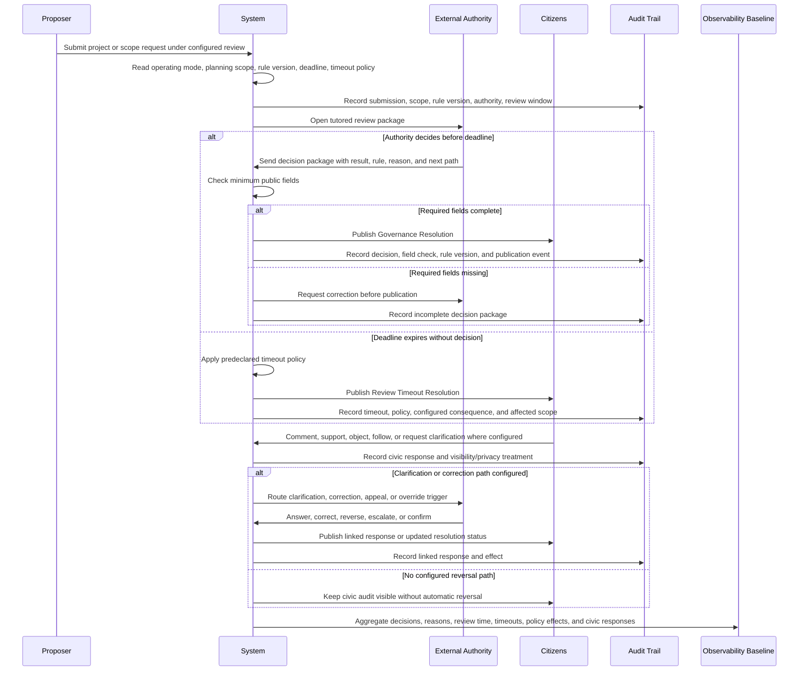
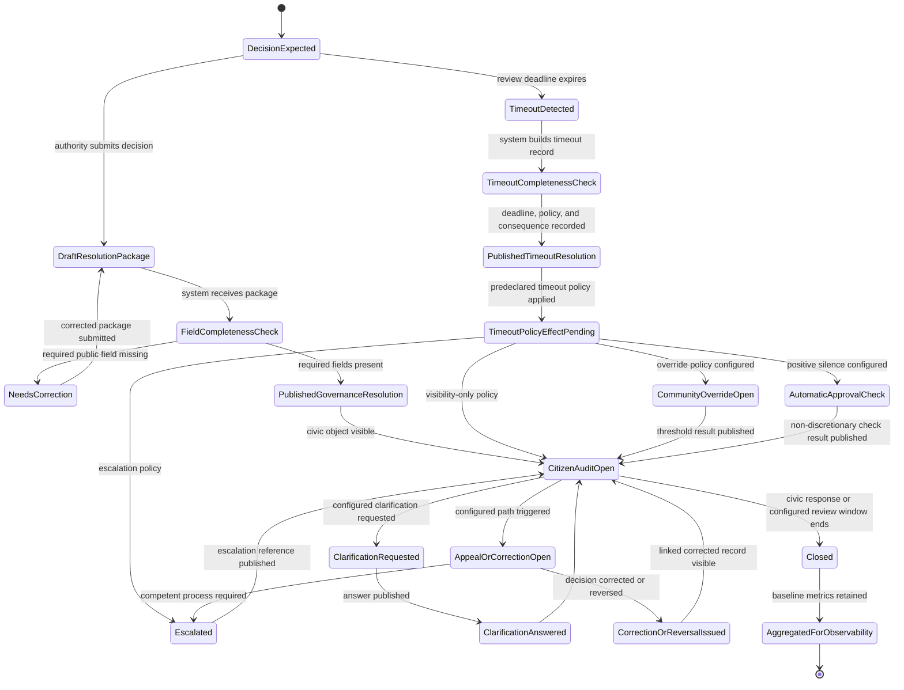
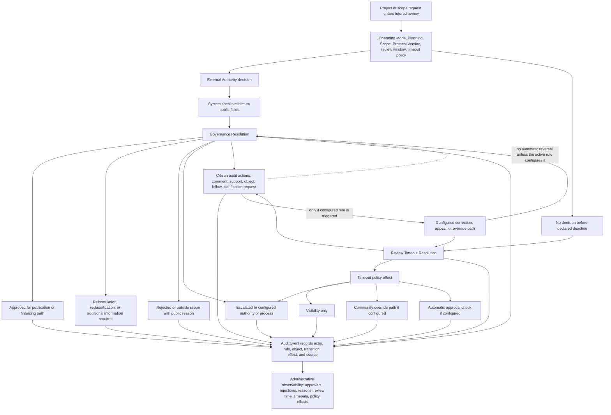

# Diagram - Governance Resolution Sequence v0

## Purpose

Show how a material tutored governance decision, or the absence of a decision before timeout, becomes a public civic object without making the platform the sovereign decision-maker.

This diagram expands the earlier tutored-mode sketch by separating:

- the external authority decision;
- the system completeness check for required public fields;
- the automatic timeout record;
- citizen audit actions;
- configured clarification, correction, appeal, or override paths;
- audit events and aggregate observability effects.

Source baseline:

- [[58_TUTORED_MODE_GOVERNANCE_RESOLUTIONS_AND_C020_RESOLUTION|docs/58_TUTORED_MODE_GOVERNANCE_RESOLUTIONS_AND_C020_RESOLUTION.md]]
- [[59_CORE_ADMINISTRATIVE_OBSERVABILITY_BASELINE_AND_C021_RESOLUTION|docs/59_CORE_ADMINISTRATIVE_OBSERVABILITY_BASELINE_AND_C021_RESOLUTION.md]]
- [[57_PROTOCOL_CHANGE_AND_C019_RESOLUTION|docs/57_PROTOCOL_CHANGE_AND_C019_RESOLUTION.md]]
- [[35_CONSOLIDATED_ENTITY_OBJECT_STATE_MAP|docs/35_CONSOLIDATED_ENTITY_OBJECT_STATE_MAP.md]]
- [[64_FORMAL_ENTITY_INVENTORY_V0|docs/64_FORMAL_ENTITY_INVENTORY_V0.md]]
- [[v0-operating-mode-transition-state|docs/diagrams/v0-operating-mode-transition-state.md]]
- [[v0-tutored-mode-governance-resolution|docs/diagrams/v0-tutored-mode-governance-resolution.md]]

Related sources: C007, C019, C020, C021, H009, H017, H058.

## Governance Resolution Publication Sequence



## Governance Resolution Object Lifecycle



## Resolution Effect Routing



## Minimum Field Rule

The `Governance Resolution` minimum field set is:

```text
resolution id
related project or request
public function
operating mode
decision type
decision result
responsible authority or authorized process
responsible official or role, where legally publishable
decision date
rule or eligibility criterion applied
plain-language reason
suggested next action
appeal or correction path, if configured
citizen-facing summary
audit trail reference
```

The `Review Timeout Resolution` minimum field set is:

```text
timeout resolution id
related project or request
public function
operating mode
submission date
review deadline
days elapsed
responsible authority or process
configured timeout policy
automatic consequence, if any
citizen-facing summary
audit trail reference
```

## Rules

- The authority or authorized process decides in tutored mode; the platform records, checks minimum publishable fields, publishes the civic object, and applies configured platform effects.
- Missing required public fields should create a correction request before publication rather than allowing opaque decisions to disappear into an internal record.
- A timeout consequence must be configured before submission. The administrator must not improvise the consequence after silence occurs.
- Citizen audit actions are civic visibility and accountability signals. They do not automatically reverse a decision unless the active operating-mode rule explicitly configures a correction, appeal, community override, or automatic-approval mechanism.
- Governance resolutions and timeout resolutions must reference the operating mode, planning scope, protocol or rule version, audit trail, and affected project or request.
- Governance resolutions and timeout resolutions should preserve A011 minimum moderation-audit fields, including reason category where practical, review time, timeout status, and known authority-linked operator context.
- The observability baseline aggregates basic patterns over time. Full moderation-abuse dashboards, automatic possible-abuse findings, cross-actor rejection-rate comparisons, and operator-concentration analytics remain Extension v1+ or country/administrator observability.
- Observability metrics do not convert into a hidden success score or automatic legal reversal.
- A public authority issuing or failing to issue a resolution remains an external actor under the C007 boundary. It does not become an internal proposer, executor, fiscalizer, delegate, or ordinary moderator in the same controlled scope.

## Macul Sports Example Trace

```text
Project:
Design and Construction of Multi-Courts in Macul.

Operating mode:
Sports function in tutored mode with a 30-day review window.

Authority decision:
Rejected because the proposed location duplicates an already approved public sports project.

Governance Resolution:
Published with the applied duplication rule, responsible authority/process, plain-language reason, suggested next path, and audit trail reference.

Citizen audit:
Citizens may comment, support, object, follow, or request clarification if that path is configured. These actions create visible accountability and aggregate observability, but they do not automatically overturn the rejection.

If no decision arrives in 30 days:
The system publishes a Review Timeout Resolution and applies the timeout policy that was public before submission, such as visibility only, escalation, community override trigger, or automatic approval after non-discretionary checks.
```

## Boundary With Other Diagrams

This diagram does not replace:

- the `OperatingMode` transition state diagram;
- the project creation and publication flow;
- the complaint review state diagram;
- the audit event schema diagram.

It defines the public decision record and civic audit path created by tutored decision or tutored silence.

## Rule

> Tutored authority may decide, but it may not decide invisibly. Tutored silence may persist as a political choice, but it must become a public timeout object with a predeclared consequence.
