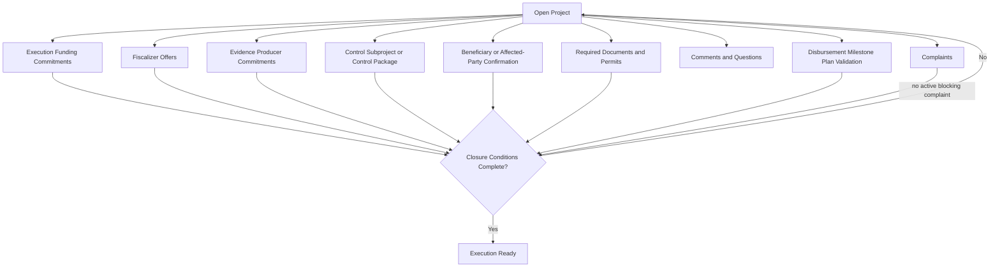

# Diagram - Open Project Parallel Closure v0

## Purpose

Show that execution readiness depends on multiple closure conditions, including both execution funding and independent control capacity.

Related resolutions: C002, C003, C013, C016.

## Rule

> A project becomes execution-ready only when execution funding, control capacity, evidence capacity, documents, complaints, and disbursement-plan validation are coherent.
