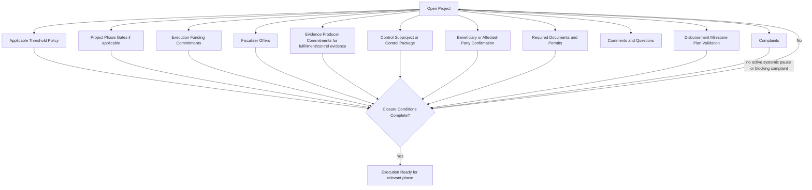

# Diagram - Open Project Parallel Closure v0

## Purpose

Show that execution readiness depends on the project's applicable threshold policy and multiple closure conditions, including both execution funding and independent control capacity.

Related references: H019, H027, C002, C003, C013, C016.

## Rule

> A project becomes execution-ready only when its applicable threshold policy is visible and the required execution funding, phase gates, control capacity, fulfillment/control evidence capacity, documents, complaints, and disbursement-plan validation are coherent.
