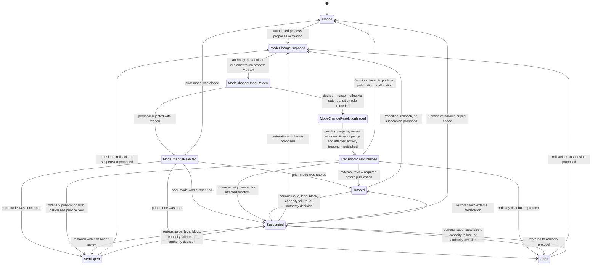
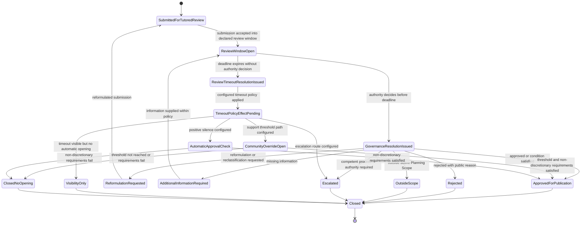
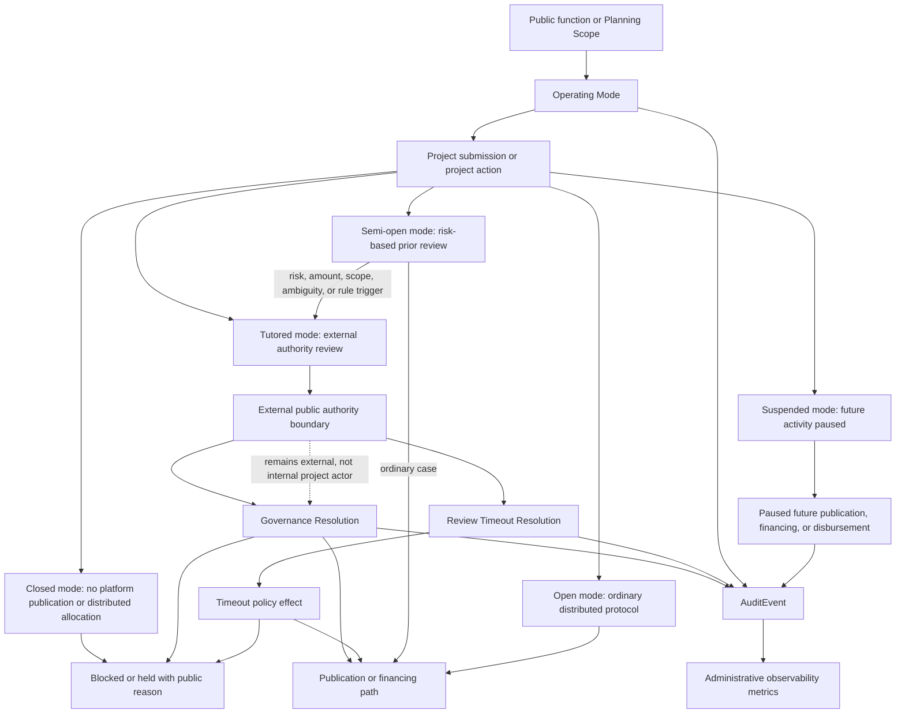

# Diagram - Operating Mode Transition State v0

## Purpose

Show how `OperatingMode` governs a public function without turning the platform into the sovereign decision-maker.

Operating modes are technical states representing country, authority, protocol, or implementation choices. The platform records and enforces the configured rules, publishes tutored decisions and tutored silence, and preserves auditability. It does not force a country to move from tutored mode to open mode.

Source baseline:

- `docs/58_TUTORED_MODE_GOVERNANCE_RESOLUTIONS_AND_C020_RESOLUTION.md`
- `knowledge/hypotheses/H058-operating-modes-for-transition.md`
- `docs/diagrams/v0-tutored-mode-governance-resolution.md`
- `docs/35_CONSOLIDATED_ENTITY_OBJECT_STATE_MAP.md`
- `docs/37_SCOPE_CLASSIFICATION_MATRIX_V0.md`
- `docs/64_FORMAL_ENTITY_INVENTORY_V0.md`

Related sources: C007, C019, C020, C021, H009, H017, H057, H058.

## Operating Mode Transition State Machine

This state machine tracks the operating mode of a public function or configured scope.



## Tutored Review and Timeout State Machine

This state machine tracks a project or scope decision inside tutored mode.



## Operating Mode Effect Routing

This flowchart shows how the mode affects project publication, funding, disbursement, and auditability.



## State Rules

- `Closed` means the public function is not open to platform project publication or distributed allocation.
- `Tutored` means projects require external authority, authorized process, or country-implementation review before publication.
- `SemiOpen` means ordinary projects may proceed under general rules, while defined risk, amount, scope, ambiguity, or public-function criteria trigger prior review.
- `Open` means the ordinary distributed protocol governs publication and control without institutional pre-publication moderation.
- `Suspended` pauses future publication, pending moderation advancement, new financing, and new disbursement activity for the affected public function unless the suspension rule preserves defined critical payments.
- Mode changes apply forward by default. Published, funded, or executing projects are not retroactively punished merely because the mode changed, except where an explicit transition or suspension rule applies.
- Tutored mode may be temporary, indefinite, or permanent. The contradiction is opaque tutored governance, not tutored permanence.
- Every material tutored decision should create a public `GovernanceResolution`.
- Every tutored review must have a declared review window and timeout policy before submission.
- If no decision is issued within the declared review window, the system creates a `ReviewTimeoutResolution`.
- Timeout consequences must be preconfigured. They may be visibility only, escalation, community override trigger, or automatic approval subject to non-discretionary checks.
- A public authority in tutored mode remains an external authority actor. It does not become an internal proposer, executor, fiscalizer, delegate, ordinary moderator, or competitor in the same controlled scope.
- State-owned or publicly owned operators may participate only where the C007 public-authority/operator boundary permits it.

## Macul Sports Example Trace

```text
Public function:
Sports.

Operating mode:
Tutored with 30-day review window and visibility-plus-escalation timeout policy.

Project:
Design and Construction of Multi-Courts in Macul.

Authority decision before timeout:
Rejected for duplicate public project if the same facility and location are already approved in the traditional ministry portfolio.

System object:
Governance Resolution with public reason, applied scope rule, suggested next path, responsible authority/process, and audit trail.

If no decision is issued within 30 days:
Review Timeout Resolution is created automatically.
The configured timeout policy applies; the administrator cannot improvise the consequence after silence occurs.

If the function later changes from Tutored to Semi-open:
New submissions follow semi-open rules.
Pending moderation follows the transition rule.
Already funded projects are not retroactively invalidated merely because the operating mode changed.
```

## Boundary With Other State Machines

This diagram does not replace:

- the Governance Resolution sequence diagram;
- the project creation and publication flow;
- the project state diagram;
- complaint, pause, disbursement, or protocol-change diagrams.

It defines the mode gate that routes those workflows.

## Rule

> The country or authorized governance process decides the operating mode. The platform must make the mode, rules, decisions, silence, timeout policies, transition effects, and authority boundaries visible and auditable.
