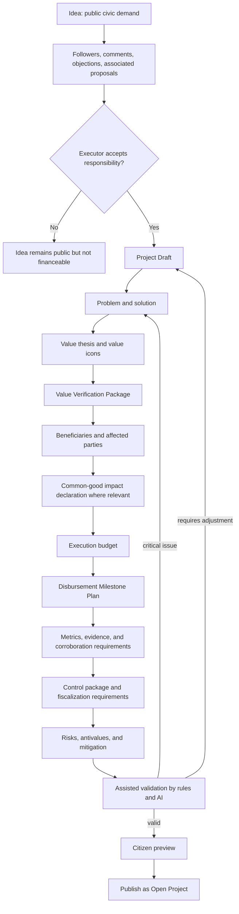

# Diagram - Project Creation and Publication v0

## Purpose

Show how an idea becomes a financeable project only after responsibility, value, budget, evidence, fiscalization, common-good impact, and disbursement plan requirements are coherent.

Related resolutions: C001, C002, C008, C010, C016, C022.

## Rule

> Ideas capture demand. Projects execute responsibility. AI may assist validation, but publication depends on protocol rules and accountable project roles.
