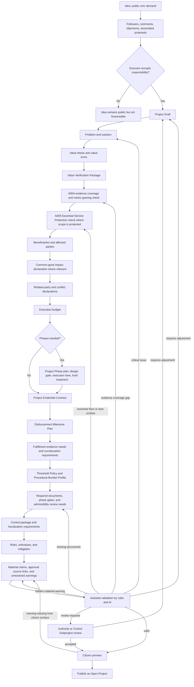

# Diagram - Project Creation and Publication v0

## Purpose

Show how an idea becomes a financeable project only after responsibility, value, budget, Project Evidential Contract, fiscalization, common-good impact, related-party conflict, material visibility, and disbursement plan requirements are coherent.

Related references: C001, C002, C008, C010, C013, C016, C020, C022, H018, H019, H020, H022, H027, H028, A001, A002, A004, A005.

## Rule

> Ideas capture demand. Projects execute responsibility. AI may assist requirement discovery, but publication depends on protocol rules, an accepted evidential contract, A004 evidence coverage, A005 essential-service floor/lane clarity where applicable, required documents, threshold policy, procedural burden profile, material visibility of claims and approval conditions, and accountable project roles or reviewers where applicable.
