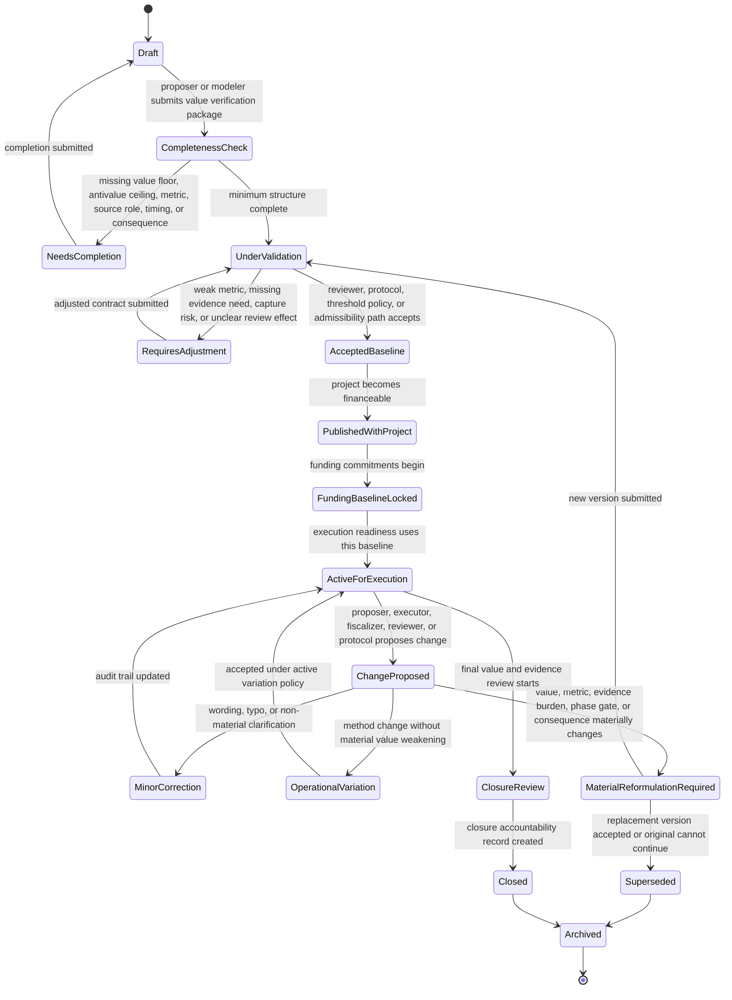
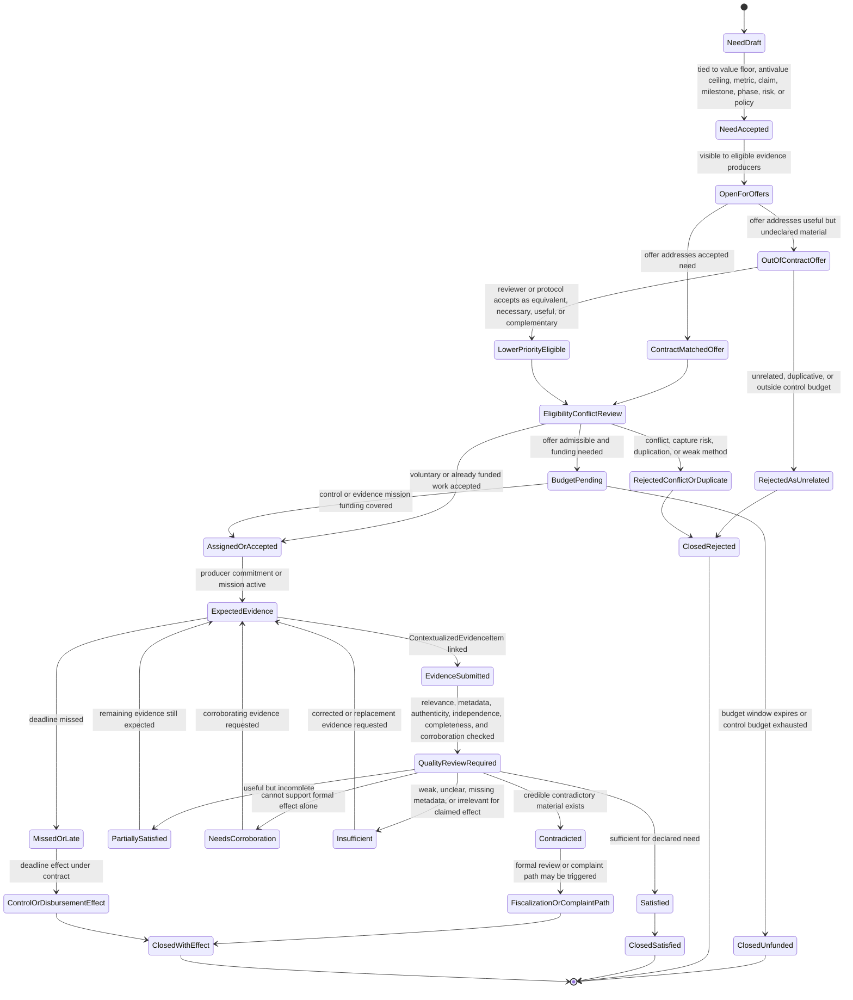
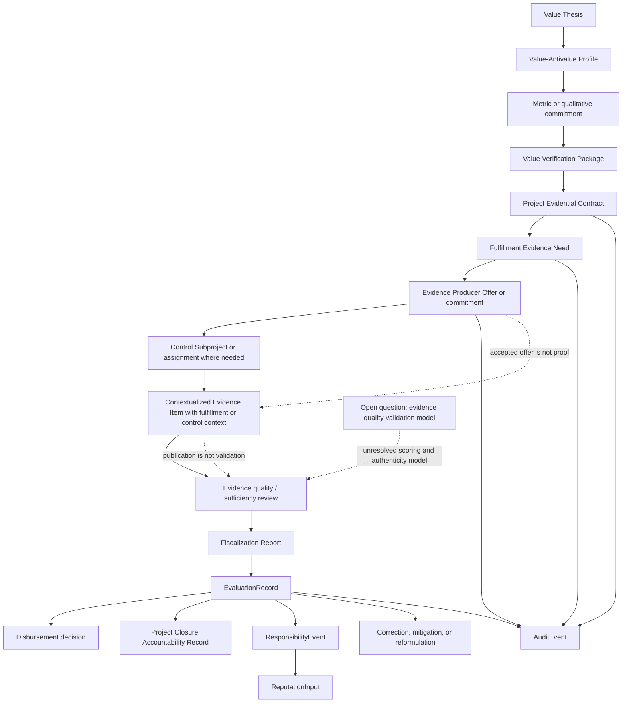

# Diagram - Project Evidential Contract State v0

## Purpose

Show how a `Project Evidential Contract` and its `Fulfillment Evidence Need` records move from project design into producer offers, evidence production, review, and formal effects.

This diagram formalizes the chain:

```text
Value Thesis
-> Value Verification Package
-> Project Evidential Contract
-> Fulfillment Evidence Need
-> Evidence Producer Offer or commitment
-> Contextualized Evidence Item
-> Fiscalization / Evaluation Record
-> disbursement, closure, responsibility, reputation, correction, or reformulation effect
```

The contract defines evidence needs and source-role expectations. It does not preselect evidence producers and does not validate submitted evidence by itself.

Source baseline:

- `knowledge/hypotheses/H018-project-value-thesis-and-measurement.md`
- `knowledge/hypotheses/H022-project-evidential-contract.md`
- `docs/44_VALUE_VERIFICATION_AND_C010_RESOLUTION.md`
- `docs/10_FISCALIZATION_EVIDENCE_AND_CONTROL_MODEL.md`
- `docs/24_CITIZEN_EVIDENCE_PRODUCTION_FLOW.md`
- `docs/46_EVIDENCE_PRODUCERS_AND_C003_RESOLUTION.md`
- `knowledge/open-questions/evidence-producer-evidence-quality-validation.md`
- `docs/64_FORMAL_ENTITY_INVENTORY_V0.md`
- `docs/diagrams/v0-contextualized-evidence-item-state.md`

Related sources: H012, H015, H016, H018, H022, H023, C003, C010, C015, C016, C018.

## Project Evidential Contract State Machine

This state machine tracks the contract baseline. It is not the same as the state of a submitted evidence item.



## Fulfillment Evidence Need and Producer Offer State Machine

This state machine tracks a requirement and the producer offers or commitments that try to satisfy it.



## Value-to-Effect Routing

This flowchart shows how the contract connects project promises to formal effects. It also marks the unresolved evidence-quality issue as a boundary, not as a solved scoring model.



## State Rules

- `Project Evidential Contract` is part of the financeable project baseline. A project should not receive execution funding without a proportional accepted contract.
- The contract is versioned. A material weakening of value metrics, evidence needs, source roles, phase gates, disbursement criteria, or review consequences requires reformulation or review rather than silent editing.
- `Value Verification Package` is the value-specific portion of the evidential contract. It should avoid isolated input metrics and connect each value floor or antivalue ceiling to evidence and review consequences.
- `Fulfillment Evidence Need` defines what must be evidenced. It does not name the final evidence producer as part of the project promise.
- Evidence producer offers that match the accepted contract receive higher eligibility priority.
- Out-of-contract fulfillment/control evidence may still be accepted when equivalent, necessary, materially useful, or complementary, but normally has lower priority and should not consume control budget ahead of accepted minimum needs.
- An accepted evidence producer offer, paid mission, or assignment is not proof of fulfillment. It only creates an expected evidence task.
- Submitted evidence becomes a `ContextualizedEvidenceItem` with fulfillment or control context. It still needs review before disbursement, closure, responsibility, reputation, or complaint effects.
- Evidence-quality validation remains an open Core v0 question. This diagram recognizes the required gate but does not finalize a scoring or authenticity model.

## Macul Example Trace

```text
Project:
Design and Construction of Multi-Courts in Macul

Value thesis:
Create usable public sports infrastructure for the community.

Value floors:
accepted court dimensions, public access, safe usable facility, bathroom or accessibility commitments where required.

Antivalue ceilings:
for example, maximum construction noise at declared times and points where the project accepts that commitment.

Project Evidential Contract:
design package, dimension verification, public-access rule verification, bathroom/accessibility review, construction milestone evidence, georeferenced site evidence, fiscalizer review, and final public-use evidence.

Fulfillment Evidence Need:
verify that construction delivered courts with accepted dimensions and public access.

Evidence producer offer:
field measurement visit, georeferenced photos, public-access observation, and short report linked to the construction milestone.

Priority:
high if the offer directly satisfies the accepted need.
lower if it only provides generic photos not tied to dimensions, access, bathrooms, milestone, date, or location.

Quality risk:
photos may be real but incomplete, taken from one angle, missing metadata, AI-altered, or irrelevant to the claimed dimension metric.
The fiscalizer cannot rely on them for release or closure until the quality and sufficiency review supports the intended effect.
```

## Boundary With Other State Machines

This diagram does not replace:

- the contextualized evidence item state diagram;
- the control subproject and fiscalization assignment diagram;
- the funding and disbursement state diagram;
- the complaint evidence and review state diagram.

It defines the ex ante contract and the evidence-need lifecycle that those other diagrams use.

## Rule

> The project must declare how fulfillment will be known before execution funding. That declaration creates evidence needs, not captive producers, and submitted evidence creates review material, not automatic truth or automatic formal effects.
