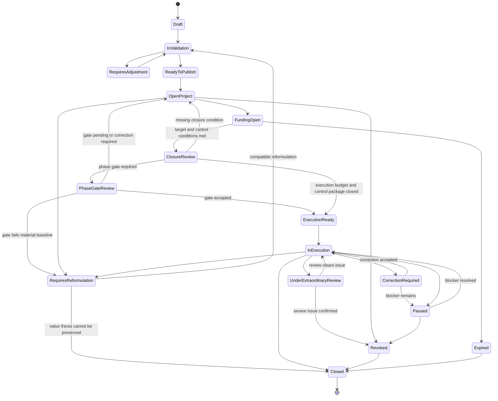

# Diagram - Project Lifecycle State v0

## Purpose

Show the project lifecycle after publication, including validation, execution readiness, reformulation, review, revocation, and closure.

Related resolutions: C005, C016, C017, C018, H019.

## Rule

> A project advances through validated conditions and review, not self-declared progress. Closure labels are procedural context; reputation depends on verified fulfillment and responsibility events.
