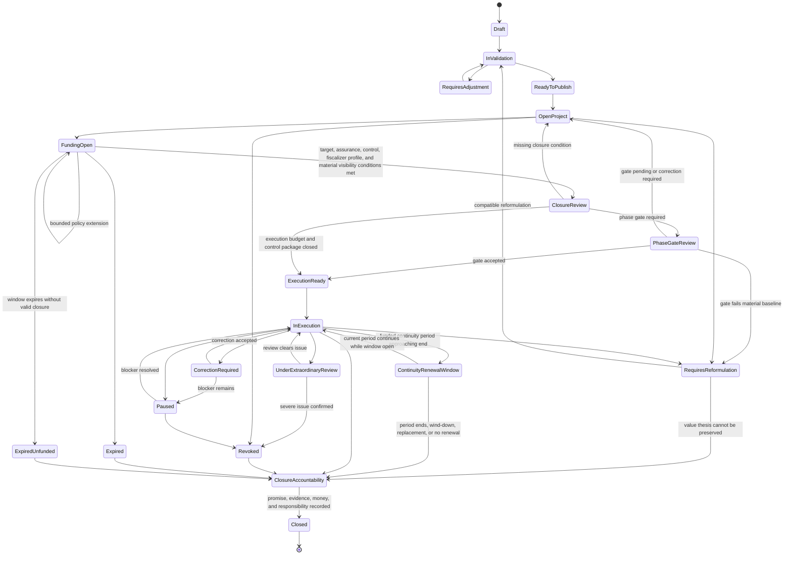

# Diagram - Project Lifecycle State v0

## Purpose

Show the project lifecycle after publication, including validation, execution readiness, reformulation, review, revocation, and closure.

Related resolutions: C005, C016, C017, C018, H008, H011, H019, H040, A001, A002, A003, A006, Funding Window Expiry.

## Rule

> A project advances through validated conditions and review, not self-declared progress. Execution readiness should not hide unresolved material warnings behind favorable labels. Open funding is bounded by a visible Funding Attempt; if the window expires without valid closure, the project or lane becomes Expired Unfunded unless a bounded extension or reformulation route applies. For continuity-sensitive projects, a renewal window exposes the follow-on need and may generate an Idea, but it does not automatically renew the current executor. Closure requires a Project Closure Accountability Record. Closure labels are procedural context; reputation depends on verified fulfillment and responsibility events.
