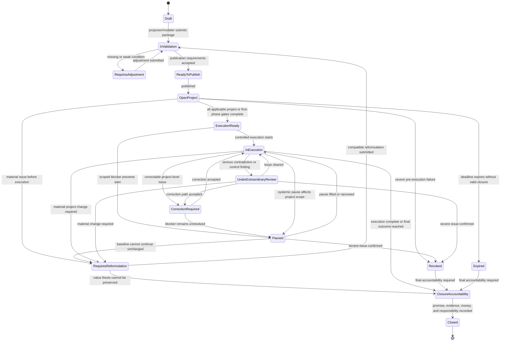
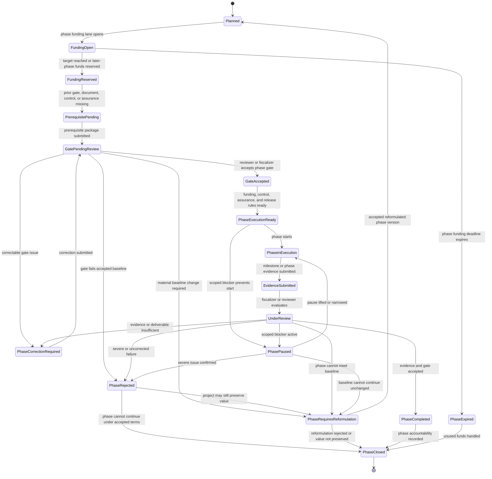

# Diagram - Project Object State with Phase Substates v0

## Purpose

Show the formal `Project` state machine together with the operational substates of each `ProjectPhase`.

This diagram refines the older project lifecycle diagram. It separates the parent project state from phase-level gates, funding reservation, evidence review, and scoped blockers. It should guide future object modeling, schema drafting, and state transition rules.

Source baseline:

- `docs/64_FORMAL_ENTITY_INVENTORY_V0.md`
- `docs/35_CONSOLIDATED_ENTITY_OBJECT_STATE_MAP.md`
- `docs/diagrams/v0-formal-entity-relationship.md`

Related sources: H008, H011, H013, H016, H018, H019, H021, H022, C005, C016, C017, C018, C024.

## Parent Project State Machine



## Project Phase Substate Machine

Each explicit `ProjectPhase` has its own operational state. The parent project may contain one or many phase instances.



## State Interpretation Rules

- `Project` state is the aggregate and citizen-facing state. It should not hide phase-specific blockers, but it should not automatically inherit every phase substate as a whole-project state.
- `ProjectPhase` state is operational and gate-specific. It controls phase readiness, prerequisite gates, phase evidence, and phase disbursement.
- A phase-level pause, rejection, correction, or review escalates to the parent `Project` only when the related `SystemicPauseRecord`, `EvaluationRecord`, `ComplaintAdmissibilityReferralRecord`, `ProjectVariationRecord`, or `ReformulationProposal` declares a project-level affected scope.
- `ExecutionReady` may apply to the parent project, a specific phase, or both. A later phase can remain `FundingReserved` or `PrerequisitePending` while an earlier phase is `PhaseInExecution`.
- `ClosureAccountability` is a parent project state because final accountability must summarize promises, phases, evidence, fiscalization, money treatment, responsibility events, and reputation inputs.
- Phase closure does not equal project closure unless all required phases and final project accountability conditions are complete.

## Macul Example Trace

```text
Project:
Design and Construction of Multi-Courts in Macul

Parent project:
OpenProject -> ExecutionReady -> InExecution

Design phase:
FundingReserved -> GatePendingReview -> PhaseInExecution -> UnderReview

Construction phase while design is pending:
FundingReserved -> PrerequisitePending

If design evidence is insufficient:
Design phase -> PhaseCorrectionRequired
Construction phase -> PrerequisitePending
Construction disbursement -> blocked by phase gate
Parent project -> remains InExecution unless the review record declares project-level reformulation or pause

If design removes required bathrooms, changes court dimensions, or weakens public access:
Design phase -> PhaseRequiresReformulation
Parent project -> RequiresReformulation if the accepted public-value baseline cannot be preserved
```

## Boundary With Other State Machines

This diagram does not replace the future diagrams for:

- contextualized evidence item states;
- complaint evidence and complaint review states;
- funding and disbursement states;
- control subproject and fiscalization assignment states.

Those objects affect `Project` and `ProjectPhase` through explicit records and scoped formal effects. They should not be collapsed into the parent project state machine.

## Rule

> A project can be public, funded, executing, paused, reformulating, or closed only through traceable state transitions. Phase blockers remain phase-scoped unless a formal record declares a broader affected scope.
