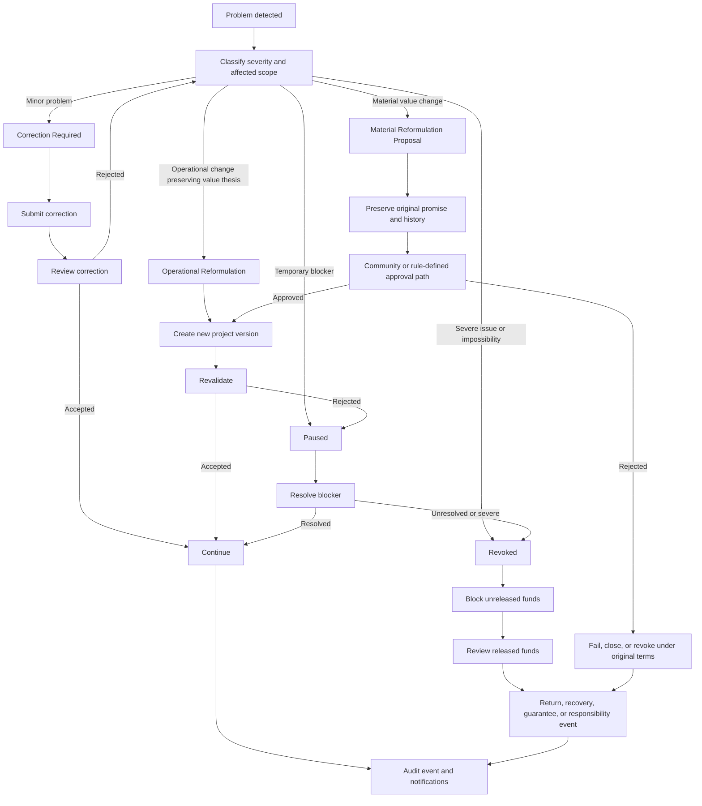

# Diagram - Reformulation, Pause, and Revocation v0

## Purpose

Show proportional project failure handling while preserving original value commitments and funding traceability.

Related resolutions: C005, C017, C018.

## Rule

> Operational reformulation may preserve the value thesis. Material value reformulation cannot silently rewrite what funders financed and beneficiaries expected.
