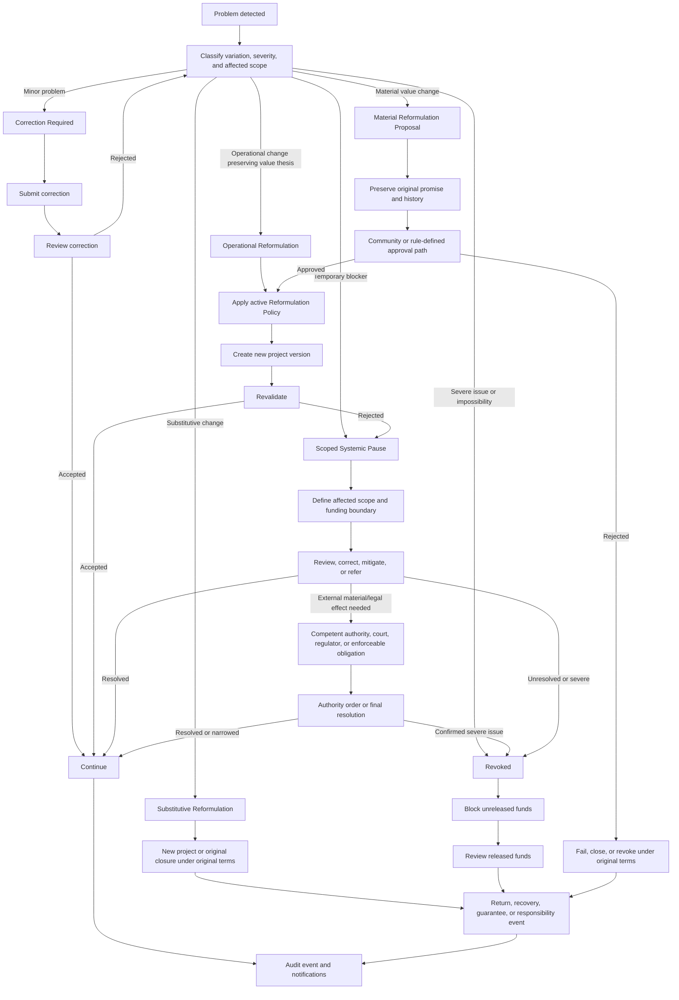

# Diagram - Reformulation, Pause, and Revocation v0

## Purpose

Show proportional project failure handling while preserving original value commitments and funding traceability.

Related resolutions and hypotheses: C005, C017, C018, H021, H040.

## Rule

> Operational reformulation may preserve the value thesis. Material value reformulation cannot silently rewrite what funders financed and beneficiaries expected.

> A systemic pause is a platform effect with affected scope and funding boundary. Physical halt, permit revocation, legal sanction, or operational suspension requires competent external authority, legal rule, court/regulator order, or enforceable accepted obligation where applicable.

> Substitutive reformulation is not the same project; it should become a new project or close, fail, or revoke the original under its original terms.
