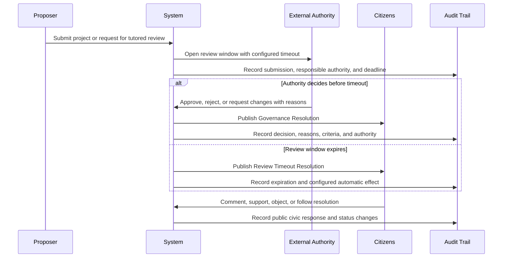

# Diagram - Tutored Mode Governance Resolution v0

## Purpose

Show how tutored-mode decisions remain external authority decisions while becoming public civic objects for audit, comment, support, objection, and follow-up.

Related resolutions: C007, C020, C021.

## Rule

> Core v0 does not force a country to leave tutored mode. It requires material tutored decisions and review silence to become visible, time-bounded, auditable civic objects.
